# Architecture — diagrams and flows

Companion to `BACKEND_DESIGN.md` (decisions), `RESEARCH_AND_SCALE.md` (evidence and scale),
`WHY_THIS_STACK.md` (rationale). This document is the **pictures**: how data moves, what each
box is responsible for, and what happens on every important path.

---

## 1. System context — who talks to what

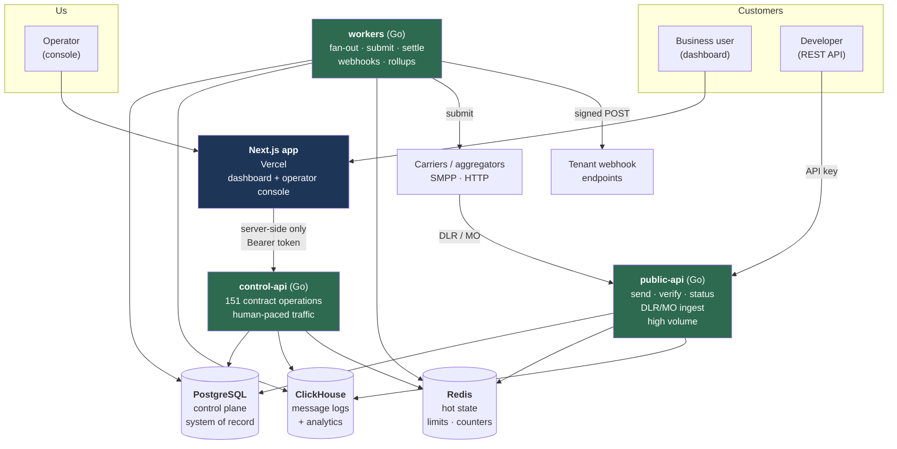

**The one rule to remember**: the browser never talks to our Go services. Every dashboard call
goes through the Next.js server, which holds the httpOnly session cookie and attaches it as a
bearer token. Only developers' own API keys and carriers reach `public-api` directly.

---

## 2. Why two databases — the split that makes billions tractable

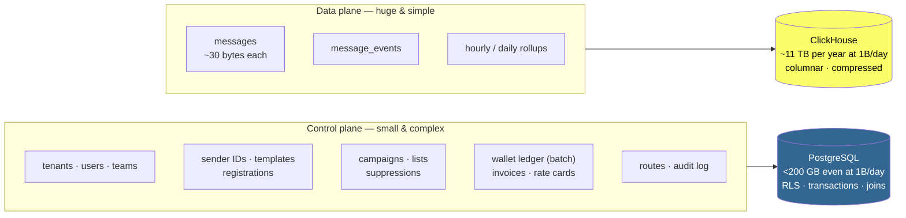

| | Control plane (Postgres) | Data plane (ClickHouse) |
|---|---|---|
| Row count at 1B msg/day | ~10⁷ total | ~10¹² and growing |
| Growth driver | tenants (slow) | messages (fast) |
| Query shape | joins, transactions | scans, aggregates |
| Needs ACID | **yes** | no |
| Per-record size | irrelevant | **everything** |

**Postgres stays the system of record.** ClickHouse is derived, rebuildable state — if we lost
it we could replay. That property is what makes running two databases safe rather than scary.

---

## 3. The send pipeline — the hot path

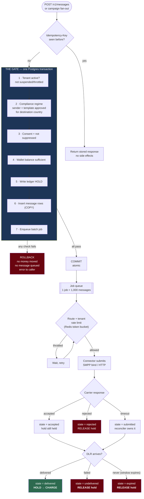

**Read the bottom three boxes.** Money converts `hold → charge` on exactly one condition:
a handset-confirmed delivery receipt. Every other terminal outcome releases the hold. That is
"no charge for undelivered" implemented as a state machine, not as a report or a nightly
correction job.

---

## 4. Message state machine

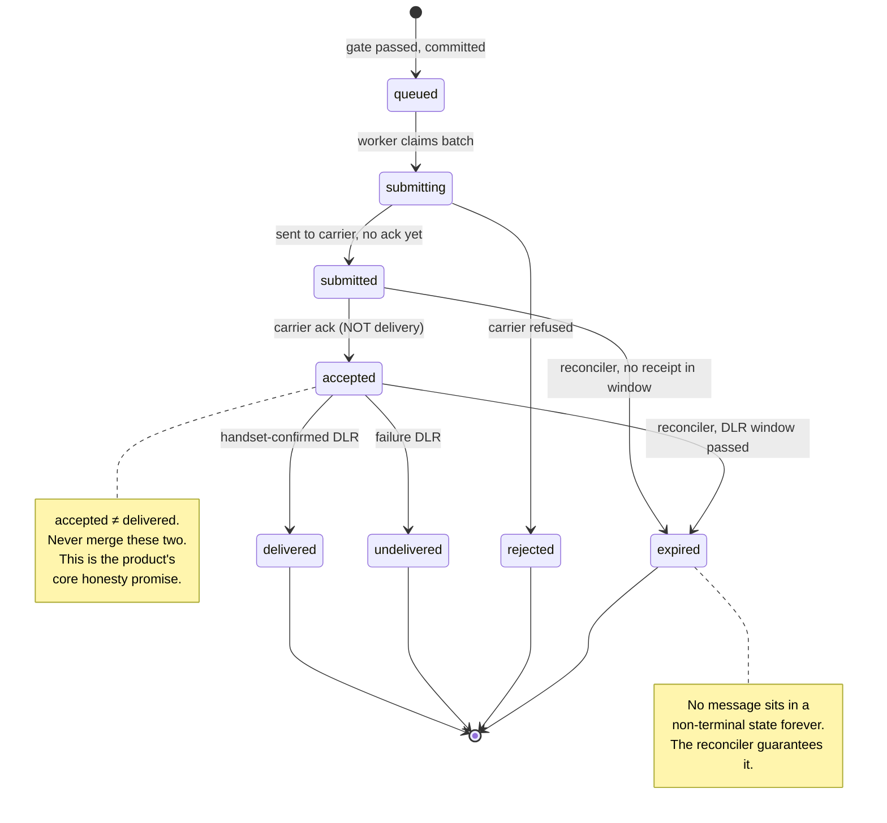

Every transition is idempotent, keyed on `(message_id, to_state)`. A carrier redelivering the
same DLR five times produces one transition and one ledger effect.

---

## 5. Campaign fan-out — why one job is 1,000 messages

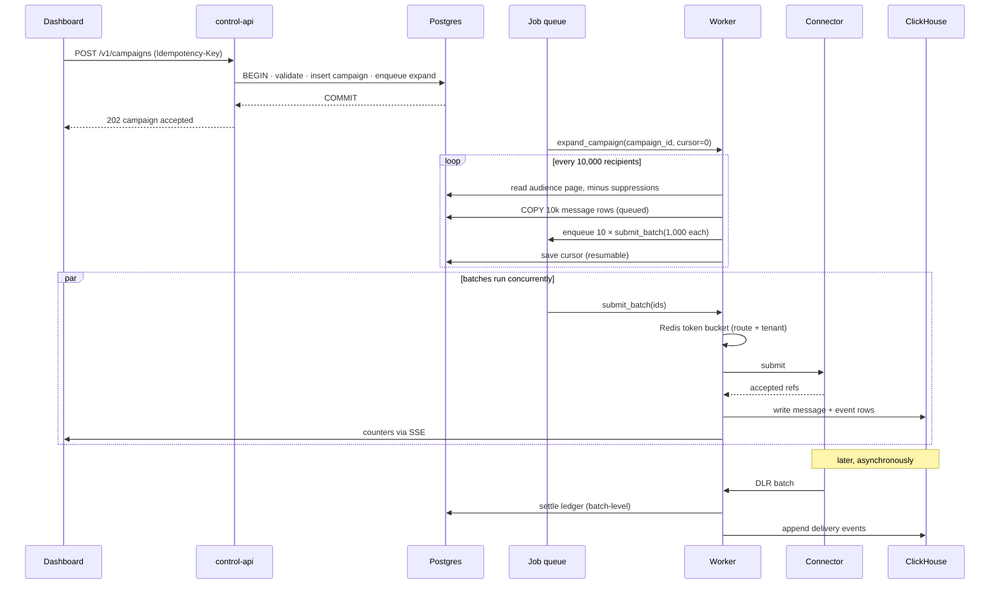

**The arithmetic that makes the queue a non-issue**: 5M recipients → 5,000 jobs, not 5,000,000.
At 30M messages/day that's ~30,000 jobs/day ≈ **0.35 jobs/sec**. The queue table stays small
enough to live entirely in RAM. Message rows are bulk-written with `COPY`, never row-by-row.

---

## 6. DLR ingest — where these systems usually die

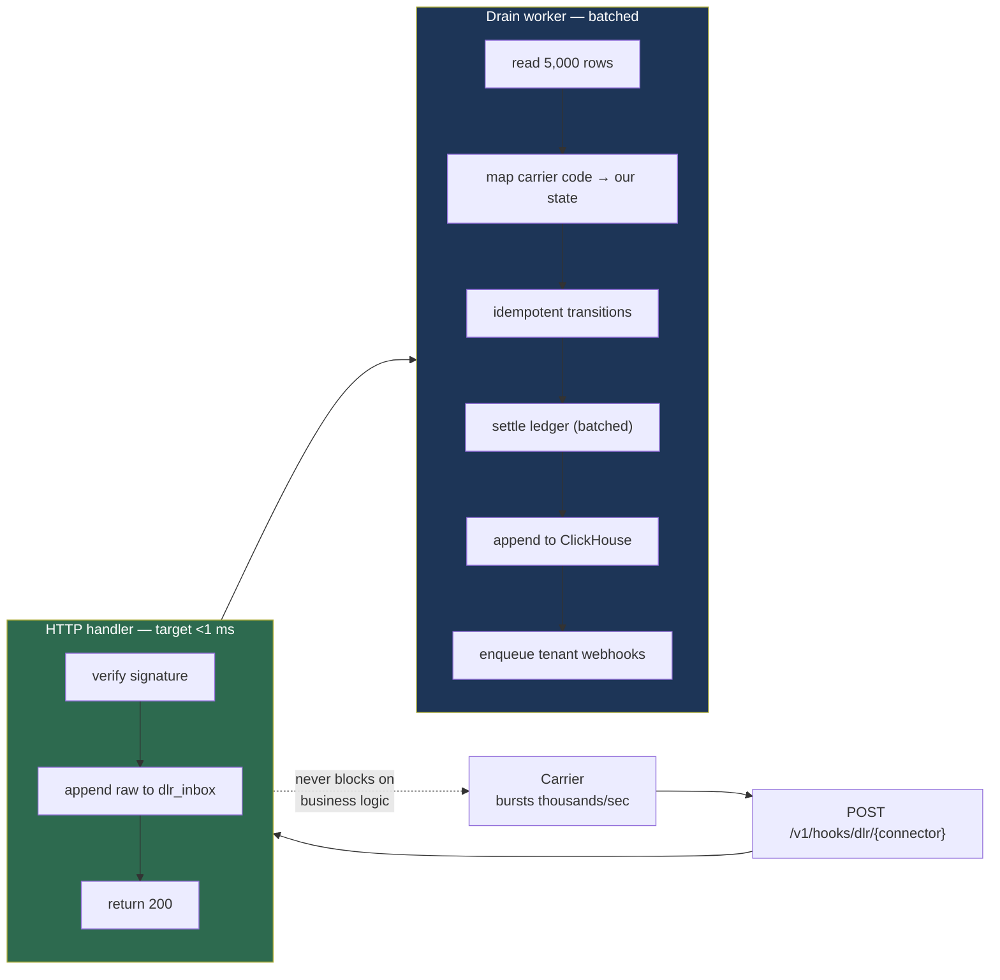

**The rule**: never do business logic inside the carrier-facing HTTP handler. Accept, persist
raw, return 200 immediately. A slow handler here means carriers time out, retry, and amplify
their own load until the system collapses. This is the single most common failure mode in SMS
platforms.

---

## 7. Tenant isolation — enforced by the database, not by discipline

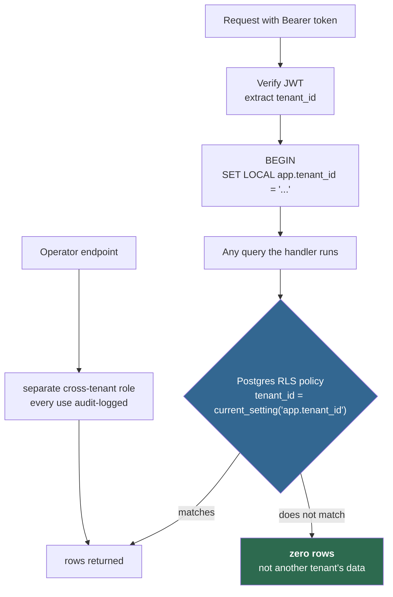

The API's database user is **not** the table owner and cannot bypass RLS. A handler that forgets
`WHERE tenant_id = ...` returns nothing instead of leaking. Cross-tenant access is possible only
through one explicitly-separate role used only by operator endpoints.

---

## 8. Money — the ledger

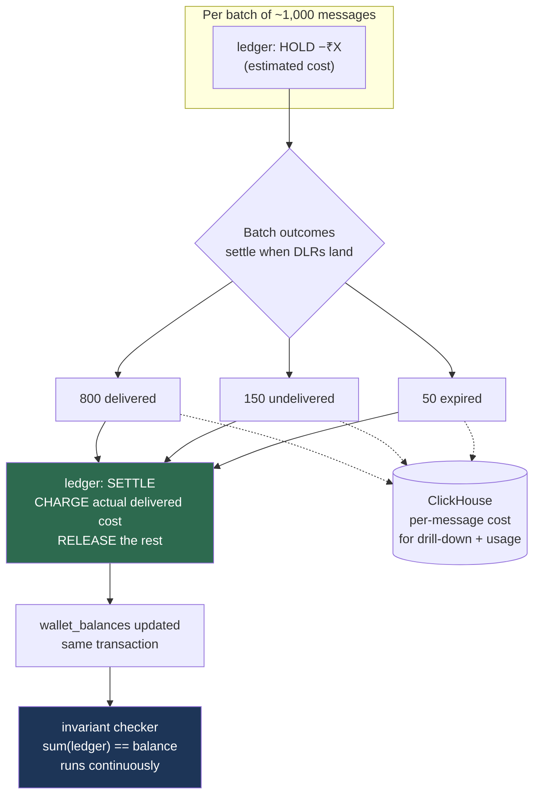

- Ledger entries are **per batch**, not per message — millions of rows per year, not billions
  per day. This is what keeps the control plane small forever.
- Per-message cost detail lives in ClickHouse, reconciled against ledger batch totals.
- All money is `BIGINT` minor units paired with a `currency`. No `NUMERIC`, no float, anywhere.
- The ledger is append-only, enforced by trigger — no `UPDATE`, no `DELETE`, ever.

---

## 9. Extensibility — three interfaces, no rewrites

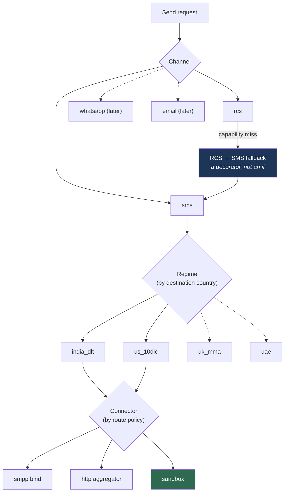

```go
type Channel   interface { Validate(Msg) error; Segments(Msg) int; Encode(Msg) (Payload, error) }
type Regime    interface { Country() string; ValidateSender(Sender) error
                           ValidateTemplate(Template) error; ValidateSend(Msg) error }
type Connector interface { Name() string; Submit(ctx, []Msg) ([]Ref, error); Health() Status }
```

New country = one `Regime` file. New carrier = one `Connector` file. New channel = one `Channel`
file. Nothing else changes. That's the "adaptability law" from the PRD, made concrete.

---

## 10. Local development topology (what we build first)

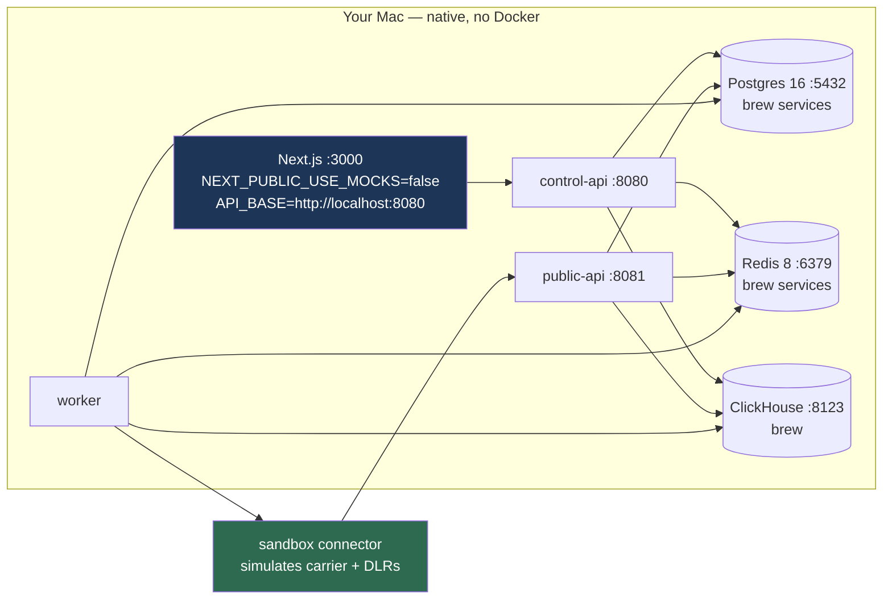

The **sandbox connector** is what makes end-to-end testing possible with no carrier: it accepts
submissions, then feeds realistic DLRs back into the ingest endpoint on a configurable delay and
success rate. Every stage gets tested against the real UI, locally, before anything touches
Hostinger.

---

## 11. Production topology (Hostinger, later)

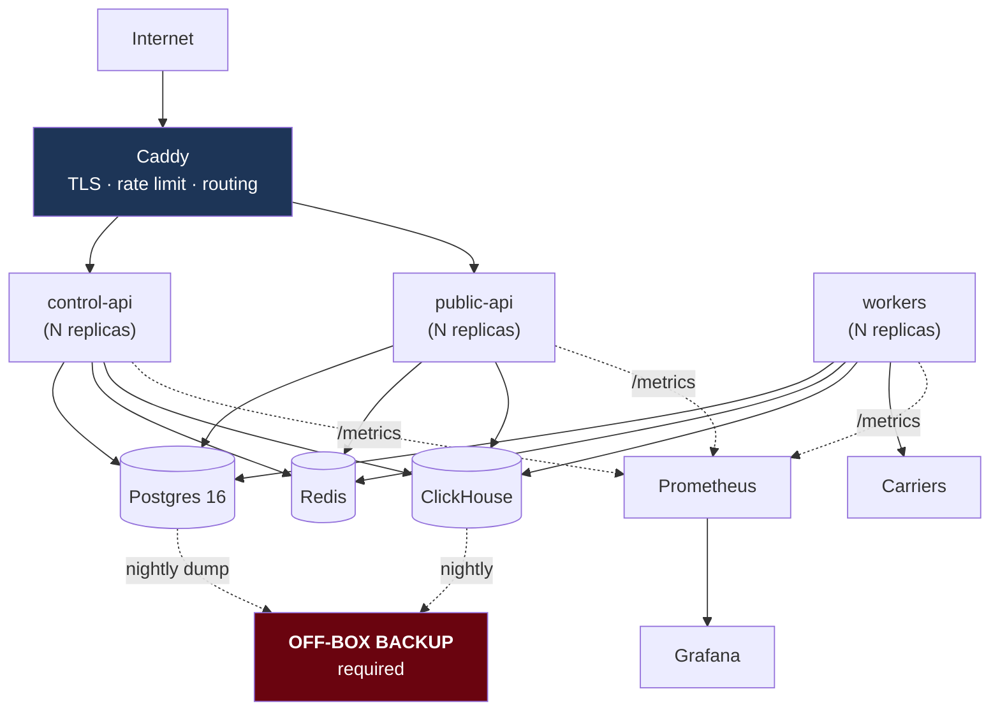

Every green box is **stateless and horizontally scalable** — adding capacity is running another
copy. All coordination lives in Postgres and Redis. That property, established on day one, is
what makes the scaling ladder in `RESEARCH_AND_SCALE.md` §3 a config change rather than a
rewrite.

The red box is not optional.

---

## 12. Request lifecycle — a dashboard read, end to end

```mermaid
sequenceDiagram
    autonumber
    participant B as Browser
    participant N as Next.js server
    participant G as control-api (Go)
    participant R as Redis
    participant P as Postgres
    participant C as ClickHouse

    B->>N: GET /messages (page navigation)
    N->>N: read httpOnly session cookie
    N->>G: GET /v1/messages?cursor=… <br/>Authorization: Bearer …
    G->>G: verify JWT → tenant_id, scopes
    G->>R: rate limit check
    G->>P: BEGIN; SET LOCAL app.tenant_id
    G->>C: SELECT … WHERE tenant_id = … <br/>keyset paginated
    C-->>G: rows + next cursor
    G-->>N: 200 MessagePage {items, nextCursor}
    N-->>B: server-rendered HTML

    Note over G,C: singleflight coalescing —<br/>concurrent identical queries<br/>hit ClickHouse once
```

---

## Diagram index

| # | Diagram | Answers |
|---|---|---|
| 1 | System context | Who talks to what |
| 2 | Two-database split | Why this scales to billions |
| 3 | Send pipeline | How a message becomes money |
| 4 | State machine | What "delivered" actually means |
| 5 | Campaign fan-out | How 5M recipients don't melt the queue |
| 6 | DLR ingest | Where these systems usually die |
| 7 | Tenant isolation | Why a forgotten WHERE can't leak |
| 8 | Ledger | Why we never charge for undelivered |
| 9 | Extensibility | How new countries/carriers/channels slot in |
| 10 | Local topology | What we're building this week |
| 11 | Production topology | Where it goes on Hostinger |
| 12 | Request lifecycle | The full round trip |
