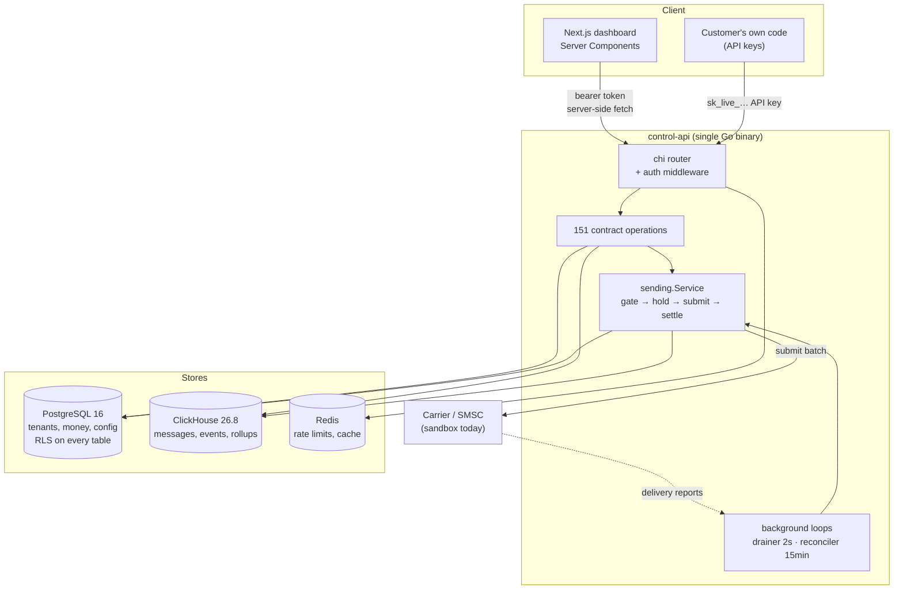
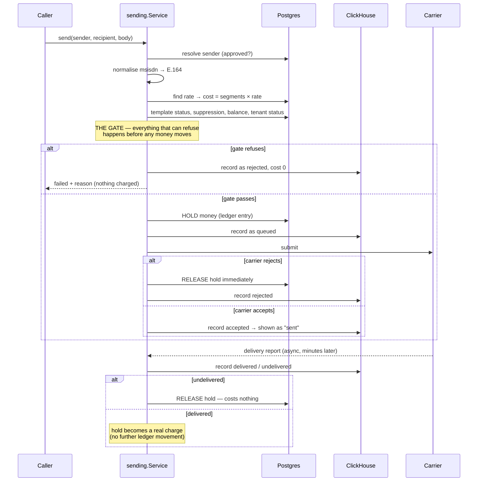
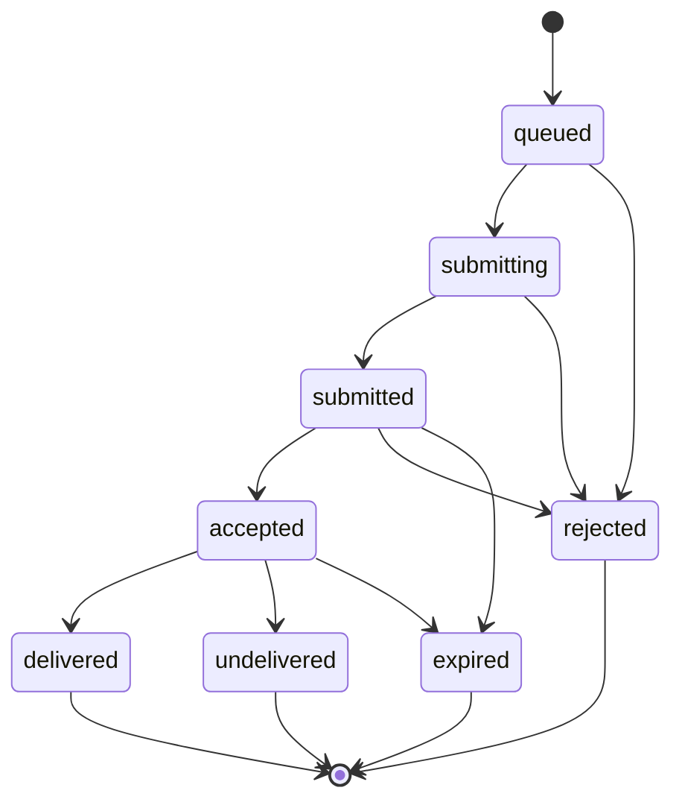
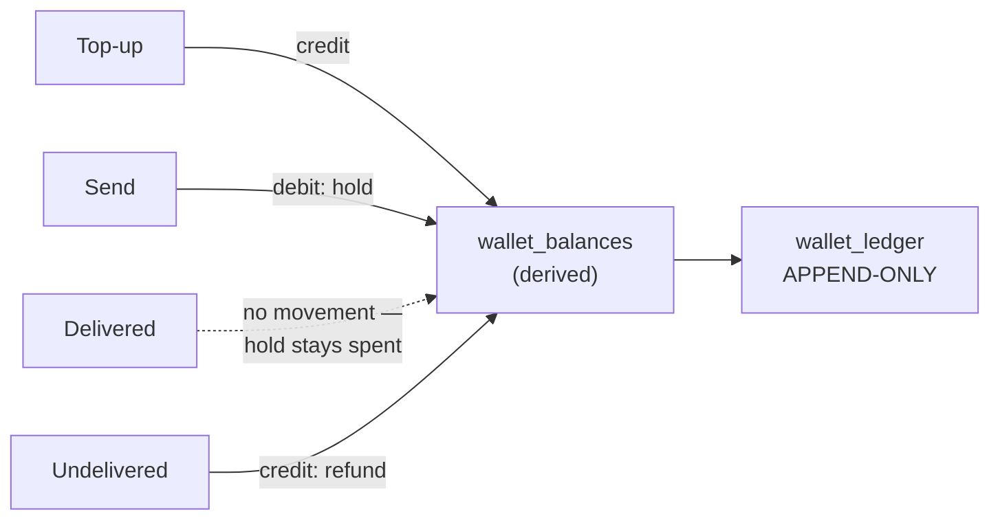
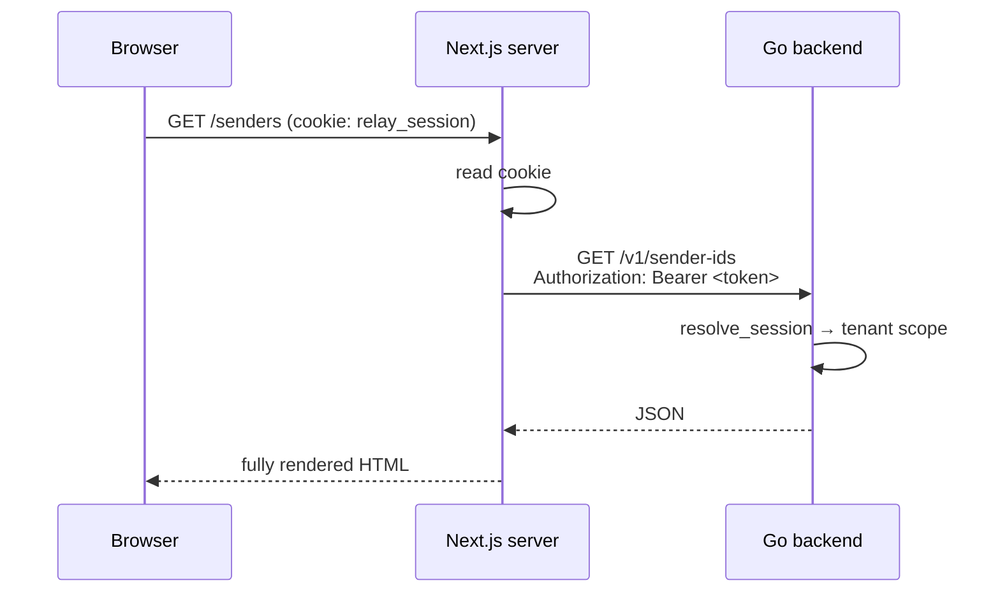

# Relay — How the backend actually works

Every number in this document was measured on the development machine
(Apple Silicon, Postgres 16, ClickHouse 26.8, all three processes local).
Nothing here is estimated unless it says so explicitly.

---

## 1. What the product is

A multi-tenant A2P messaging platform. Businesses send SMS/RCS to their
customers, and the differentiator is **billing honesty**: a message that was
not delivered costs nothing, and the refund is automatic rather than a support
ticket.

That single promise drives most of the architecture below. It is why message
state is a state machine rather than a status string, why money moves on
exactly one transition, and why "the carrier accepted it" and "the handset
received it" are different states that the type system keeps apart.

---

## 2. The shape of the system



**One binary.** Not microservices. The whole control plane, data plane and
background workers are one Go process because at this scale the operational
cost of five deployables buys nothing — and a single process means the send
gate and the billing ledger cannot drift out of sync across a network call.

### Why each store

| Store | Holds | Why not the other one |
|---|---|---|
| **Postgres** | tenants, users, senders, templates, contacts, **money** | Needs transactions, foreign keys, row-level security, and `SELECT … FOR UPDATE`. ClickHouse has none of these. |
| **ClickHouse** | messages, state transitions, hourly rollups | 36.8 bytes/row measured. The same row in Postgres is ~900 bytes with indexes. At 30M/day that difference is 26 GB/day. |
| **Redis** | rate-limit counters, hot lookups | Ephemeral, per-second churn, nothing worth durability. |

---

## 3. The send path, step by step

This is the most important flow in the system. Ordering is safety-critical.



**Why this order.** Everything that could refuse the send happens *before*
money moves and *before* anything reaches a carrier. A message that reached a
carrier but failed to be recorded is unrecoverable — the recipient got it and
we have no idea. So the recording happens first, and the money is held before
submission so a carrier can never receive a message we have not reserved
payment for.

### The gate

Checked in this order, and the order matters — the cheapest and most legally
significant refusals come first:

1. **Tenant status** — suspended tenants send nothing, effective immediately
2. **Recipient valid** — must normalise to E.164
3. **Sender approved** — an unapproved header is a carrier rejection anyway
4. **Template approved and bound to this sender**
5. **Suppression** — the recipient asked not to be contacted
6. **Balance** — can the wallet cover it

A refusal at any step costs the tenant **nothing**, and is still recorded so
"why didn't this arrive?" has an answer.

### The state machine



| Internal state | Shown in UI | Money |
|---|---|---|
| queued, submitting | `queued` | held |
| submitted, **accepted** | **`sent`** | held |
| delivered | `delivered` | **charged** |
| undelivered, rejected, expired | `failed` | **refunded** |

**`accepted` maps to `sent`, never `delivered`.** A carrier taking a message is
not a handset receiving it. That one line is where the product's honesty claim
is kept or broken, and a test fails if anyone changes it.

A transition absent from the map is refused. This is what makes delivery-report
ingest idempotent: carriers retry, and a replayed receipt cannot walk a message
backwards out of a terminal state or refund it twice.

---

## 4. Where money lives



Three rules, each enforced by the database rather than by convention:

1. **`int64` minor units.** Never floats. 12 paise is `12`.
2. **The ledger is append-only**, enforced by a trigger that raises on UPDATE
   or DELETE. Tested by attempting both **as the table owner** — if a superuser
   cannot rewrite history, nobody can.
3. **`SELECT … FOR UPDATE` on the balance row.** Removing it and running 20
   concurrent charges of 1000 deducted only 5000 instead of 20000 — **15,000
   minor units invented from nothing, with no error anywhere.** That is why the
   lock is there.

---

## 5. Measured performance

All figures from this machine, all three services local. Test: create a
contact list, launch a campaign, measure wall-clock from request to response.

### Throughput

| Operation | Measured | Notes |
|---|---|---|
| **Campaign send** | **5,000–17,900 msg/sec** | varies with DB cache warmth |
| Campaign send (20,000) | 3.43 s → **5,831/sec** | cold-ish, worst observed |
| Campaign send (5,000) | 0.28 s → **17,921/sec** | warm, best observed |
| Contact import | **2,000–4,400 rows/sec** | 20,000 rows in 9.8 s |

**Take the pessimistic number: 5,000 msg/sec sustained.**

- 5,000/sec × 86,400 s = **432M messages/day theoretical**
- The 30M/day target needs **347/sec — about 7% of measured capacity**
- 2–3 crore/day (20–30M) fits with **14× headroom**

### The 39× fix

The first measurement was **68 messages/second** — 5.9M/day, *below* target.
Cause: the send path did ~8 Postgres queries and 6 single-row ClickHouse
inserts **per message**, and took a row lock on the wallet **per message**,
serialising the whole campaign behind one row.

The store even carried a comment saying ClickHouse "is punished by row-at-a-time
inserts, so the send path always accumulates a batch — never one insert per
message." The code did exactly one insert per message. The comment was
aspirational.

Batching the campaign path:

| | Per message (before) | Per 500 messages (after) |
|---|---|---|
| Sender/template/rate/tenant lookups | 4 queries × N | **4 total, hoisted out of the loop** |
| Suppression check | 1 query × N | **1 query for the whole page** |
| Wallet movement | 1 locked txn × N | **1 locked txn per page** |
| ClickHouse inserts | 6 × N | **6 total per page** |

**68 → 17,921 msg/sec.** Same gate, same rules, same money — only the number of
round trips changed.

### Latency (p50 / p95, 30 samples each)

| Endpoint | p50 | p95 |
|---|---|---|
| `GET /v1/me` | 0.9 ms | 1.0 ms |
| `GET /v1/wallet/balances` | 1.0 ms | 1.9 ms |
| `GET /v1/campaigns` | 1.1 ms | 1.7 ms |
| `GET /v1/contact-lists` | 1.2 ms | 1.5 ms |
| `GET /v1/sender-ids` | 1.2 ms | 2.6 ms |
| `GET /v1/messages?limit=50` | 3.3 ms | 4.1 ms |
| `GET /v1/analytics?range=30d` | 8.8 ms | 11.2 ms |

Message logs are slower because ClickHouse `FINAL` deduplicates
ReplacingMergeTree rows at read time — the accepted cost of never showing a
user two copies of their own message.

### Resource usage

| Metric | Measured |
|---|---|
| RSS idle | **105 MB** |
| RSS after 20,000-message campaign | **124 MB** |
| CPU for 20k import + 20k send | **6.57 CPU-seconds over 13.7 s wall = 0.48 cores** |
| Postgres connections held | **6** |

The Go binary is not the constraint. At 0.48 cores for 40,000 operations, a
2-core VPS has substantial headroom.

---

## 6. Storage — real bytes, and the maths at scale

Measured across 125,717 message rows and 277,155 event rows:

| Table | Rows | On disk | **Bytes/row** |
|---|---|---|---|
| `messages` | 125,717 | 4.42 MiB | **36.8** |
| `message_events` | 277,155 | 2.78 MiB | **10.5** |
| `message_rollup_hourly` | 55 | 8.31 KiB | 154.7 (aggregated) |

One message produces 1 message row + ~2.2 event rows ≈ **60 bytes on disk**.

### Projected at target volume

| Volume | Per day | 90-day retention |
|---|---|---|
| 30M/day (target) | 30M × 60 B = **1.8 GB/day** | **162 GB** |
| 100M/day | 6.0 GB/day | 540 GB |
| 1B/day | 60 GB/day | 5.4 TB |

Rollups are **permanent** while raw rows expire on a 90-day TTL, so analytics
stays correct forever at ~155 bytes per hour/channel/country/status
combination — a rounding error next to the raw data.

Postgres holds only what needs transactions: contacts measured at ~352
bytes/row, list membership ~200 bytes/row. **Postgres does not grow with
message volume** — that was the entire point of splitting the stores.

### Partitioning and expiry

`messages` is partitioned by `toDate(created_at)`. Ageing out a day is a
`DROP PARTITION` — a metadata operation — not a `DELETE` scanning billions of
rows.

---

## 7. Multi-tenancy and isolation

Every tenant-owned table has **Row-Level Security** with `FORCE` enabled, so
even the table owner is subject to it.

```sql
CREATE POLICY x_tenant_isolation ON x
    USING (tenant_id = current_tenant_id())
    WITH CHECK (tenant_id = current_tenant_id());
```

**`WITH CHECK` is not optional.** `USING` governs SELECT/UPDATE/DELETE but
**not INSERT**. A policy with only `USING` silently denies every insert with
nothing diagnostic in the log — this cost real debugging time during the build.

Every query runs through one function that sets the scope inside a transaction:

```go
store.WithTenant(ctx, pool, tenantID, func(tx pgx.Tx) error { … })
```

**Proven, not assumed:** disabling RLS makes the isolation test report tenant A
reading tenant B's row. The control can fail, and the test catches it.

### The two deliberate escape hatches

`SECURITY DEFINER` functions, used only where RLS *cannot* work because the
tenant is not yet known:

- `resolve_session(hash)` — the session establishes the tenant
- `resolve_api_key(hash)` — the key *is* the tenant claim
- `signup_tenant_owner(...)` — creates the tenant itself
- `revoke_user_sessions(...)` — must cross tenants to kill stolen sessions

Each returns the minimum needed and never leaks a hash.

---

## 8. Security model

| Concern | Approach | Why |
|---|---|---|
| Passwords | argon2id, 64 MB / 3 iterations / 4 threads | Memory-hard; GPU attack is expensive |
| Sessions | **Opaque tokens**, SHA-256 at rest | Instant revocation. A JWT stays valid until expiry — unacceptable after a password reset |
| API keys | SHA-256 hash + 14-char display prefix | High-entropy machine secret; fast hash is correct here. **Secret returned exactly once** |
| OTP codes | SHA-256, **constant-time compare** | An early-returning compare leaks matching prefix length via timing — turning one 6-digit guess into six 1-digit guesses |
| Webhook payloads | HMAC-SHA256 over `timestamp.body` | Timestamp **inside** the signature, so a captured request cannot be replayed forever |
| Webhook targets | https only; private/loopback refused | Otherwise the sender becomes an SSRF primitive into our own network |
| MFA | TOTP, QR generated in-process | The otpauth URI embeds the secret — sending it to an external QR service would leak it |

### Bugs this discipline caught

These were all found by testing that a control *fails* when it should, not by
reading the code:

1. **Password reset didn't revoke sessions.** Unscoped transaction → RLS
   filtered the UPDATE to zero rows → UPDATE reports success on zero rows. Reset
   returned 204 while stolen sessions stayed alive.
2. **OTP attempt limit did nothing.** The counter was never persisted — the
   outcome error was returned from inside the transaction closure, rolling back
   the increment. Every guess was "the first guess." A 6-digit code was
   brute-forceable.
3. **Delivery reports silently dropped.** ClickHouse 26.x defaults
   `async_insert = 1`, so an insert is unreadable for ~200 ms. A fast delivery
   report found no message, was dropped as untrusted, and the hold was never
   released — charging forever for a message that never arrived.
4. **`DummyHash` was fabricated base64.** It would fail to decode, making
   `VerifyPassword` return early with zero argon2 work — defeating the exact
   timing defence it existed to provide.

---

## 9. How the UI and backend fit together

The dashboard is **Next.js App Router with async Server Components**. Pages
fetch on the server and pass data to presentational client components.



Consequences worth knowing:

- **The session cookie becomes a bearer token** server-side. The browser never
  holds an API credential.
- **Data arrives rendered**, so a `curl` with the cookie sees the real data —
  which is what makes the shell test suite meaningful.
- **Client-side mutations** (forms) call Next route handlers or the API
  directly. These are the paths `curl` cannot exercise.

### The contract

`openapi.json` — 151 operations — is the single source of truth. The Go server
interface is **generated** from it, so an operation that drifts from the
contract fails to compile. Responses are validated against the spec in tests
using `kin-openapi`; breaking an enum makes the validator reject immediately.

**Error envelope**, on every failure:

```json
{ "error": { "code": "validation_failed", "message": "…" } }
```

Validation failures are **422**, not 400: the contract declares 400 on 1 of 151
operations and 422 on 57, so 422 is what the frontend's error states are
written against.

---

## 10. Feature map — what exists and what each part does

| Area | Operations | What it does |
|---|---|---|
| **Auth & identity** | signup, login, MFA, sessions, password reset | argon2id, opaque sessions, TOTP, instant revocation |
| **Account & team** | profile, org, members, roles | Role-scoped access |
| **Compliance** | sender IDs, registrations, templates | Per-country regimes as **data, not branches** — adding a country is a row |
| **Wallet & billing** | balances, ledger, top-up, invoices, usage | Append-only ledger, locked balance rows |
| **Pricing** | rates, cost estimator | Same segment arithmetic as the send path, so a quote and a charge cannot disagree |
| **Audience** | contacts, lists, CSV import, suppressions | Idempotent import; conflicts report the **real CSV line** |
| **Messaging** | send pipeline, message logs | The state machine above |
| **Campaigns** | create, estimate, launch, per-recipient logs | Batched fan-out; estimate frozen at creation |
| **Developer** | API keys, webhooks, IP allowlist, scopes, rate limits | Hashed secrets, real signed webhook delivery |
| **Analytics** | summary, time series, deliverability, scheduled reports | Reads rollups, never raw rows |
| **Verify (OTP)** | services, challenges, checks, attempts, analytics | Constant-time compare, real attempt lockout, per-phone rate limit |
| **Support & inbox** | tickets, threads, conversations, replies | Suppressed contacts cannot be replied to |

### Design rules applied throughout

- **Segment arithmetic is shared.** GSM-7 (160/153) vs UCS-2 (70/67) lives in
  one place, used by the estimator and the charger.
- **Counts are derived, never stored.** Campaign counts come from ClickHouse, so
  the campaign page and the logs explorer cannot disagree about one message.
- **Keyset pagination** over `(created_at, id)`, never `OFFSET` — page 10,000 of
  an OFFSET query scans 500,000 rows.
- **Compliance regimes are data.** India's DLT rules are a row, not an
  `if country == "IN"`.

---

## 11. Background workers

| Worker | Interval | Job |
|---|---|---|
| **Delivery drainer** | 2 s | Applies sandbox delivery reports. In production the carrier POSTs to an ingest endpoint instead — **identical settlement code, different trigger** |
| **Reconciler** | 15 min | Expires messages a carrier accepted and never reported on, past a 48h validity window, and **releases the held money** |

The reconciler exists because delivery reports are best-effort: carriers drop
them, networks partition, deploys happen. Without it, a lost report means a
tenant is charged forever for a message nobody can prove arrived. **Silence is
treated as failure, and failure is free.**

One tenant's settlement failure does not abort the sweep for everyone —
ClickHouse retains messages 90 days while a tenant row can be deleted sooner,
and those orphans would otherwise stall every other tenant's refund.

---

## 12. Capacity planning for deployment

Measured usage says a single modest VPS is sufficient for the 30M/day target.

| Component | For 30M/day | Reasoning |
|---|---|---|
| **CPU** | 2–4 cores | Measured 0.48 cores for 40k operations; target needs ~347 msg/sec vs 5,000+ measured |
| **RAM** | 4–8 GB | Go binary 124 MB under load. Postgres and ClickHouse want the rest for cache |
| **Disk** | 200+ GB SSD | 162 GB for 90 days of messages, plus Postgres and headroom |
| **Postgres** | shared | Does not grow with message volume |
| **ClickHouse** | shared | 1.8 GB/day, daily partitions dropped on TTL |

**When to scale out**, in order:
1. ClickHouse to its own host when disk I/O saturates
2. Multiple API replicas behind a load balancer — **move the reconciler and
   drainer to the River queue first**, or every replica double-sweeps (harmless,
   since expiry is idempotent, but wasteful)
3. Postgres read replicas for analytics if rollups ever get heavy

---

## 13. Honest status

| | |
|---|---|
| Contract operations live | **107 of 151** |
| Dashboard pages rendering real data | **32 of 33** |
| Shell end-to-end suite | **87 / 87** |
| Go test suite | green under `-race` |

**Not built:** journeys/automation (6 ops), operator console (34 ops), and the
public send API with DLR ingest.

**Known gaps:**
- The carrier is a sandbox. Outcomes are deterministic by msisdn suffix
  (`…000` rejects, `…001` unreachable, `…002` DND, `…003` never reports) so
  every failure path is reproducible on demand.
- Fan-out runs inline in the request. Correct at current list sizes; move to
  River before campaigns reach the hundreds of thousands.
- Client-side form submissions are not covered by the shell suite. The
  frontend team's 43 Playwright specs cover them and now run against this
  backend via `make ui-test`.
