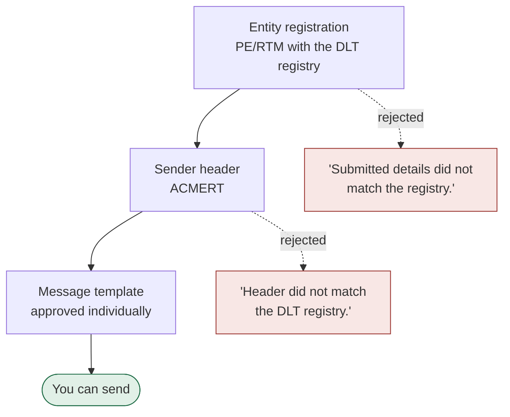

# Compliance

The regulator-facing half of the product. In India nothing sends until three separate
approvals exist.

Each object is `pending_review`, `approved` or `rejected`. **A rejection carries the
registry's own wording**, not ours, because those words tell the customer what to fix.

## The dependency is enforced in the product

The "Register sender" form does not appear until the entity is approved — the screen
shows *"Your India entity must be approved before you can register a sender"* with a
link to compliance. The backend enforces it too, because an API caller never saw the
form.

## Email is different: no regulator, but prove the domain

Creating an email sender for `notifications.acmert.example` generates three DNS records
**in the same transaction as the sender**, so the onboarding screen never shows a sender
with nowhere to send the customer next:

| Record | Host | Proves |
|---|---|---|
| SPF | `notifications.acmert.example` | which servers may send as you |
| DKIM | `relay1._domainkey.notifications…` | the message was not altered |
| DMARC | `_dmarc.notifications.acmert.example` | what to do when the first two fail |

Each verifies **independently**. "DKIM verified, DMARC still pending" is the normal
middle state of onboarding, and a single per-sender flag cannot express it.

## Consent is per channel

Priya is opted in for SMS, unknown for RCS, opted in for WhatsApp. A campaign counts
only contacts opted in for *its* channel — which is why a 4-member list can produce 2
recipients. "Unknown" is not consent.

WhatsApp adds a further rule: a business may only message inside a 24-hour window after
the customer's last message, unless using an approved template. The consent record
carries `consentedAt` per channel precisely so that window can be computed.
