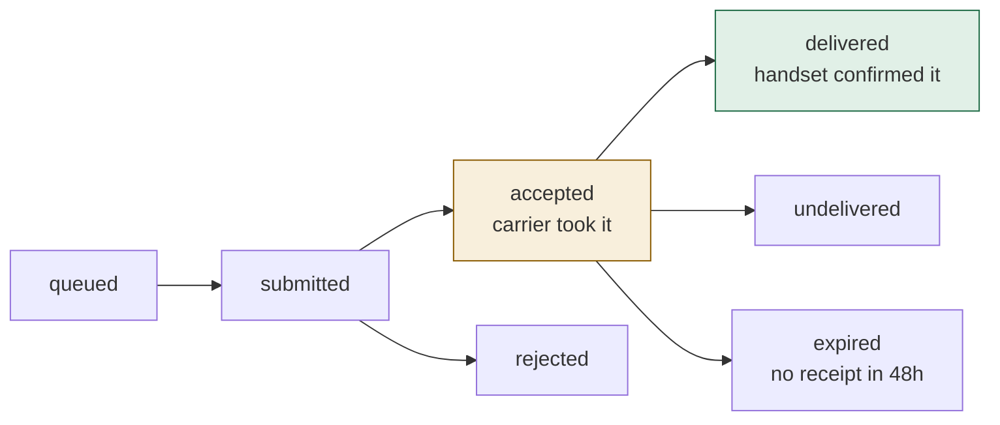
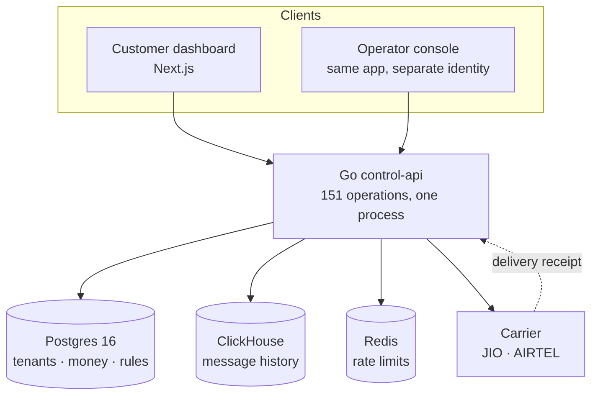

# Relay, start here

**Relay is a platform that lets a business send SMS, RCS, WhatsApp, email and voice
messages to its customers — legally, and without paying for messages that never
arrived.**

That second half is the product. Read it twice.

---

## The problem, in one paragraph

A shop in Mumbai wants to tell 1,840 customers about a Diwali sale. It cannot simply
"send SMS". In India, the telecom regulator requires the business to be registered,
the sender name to be pre-approved, and every message template to be pre-approved.
Separately, anyone who ever replied STOP must never be contacted again — and if they
are, that is a fine, not a bug report. Then, once the message is sent, the carrier
will tell you it *accepted* the message. Whether a handset ever *received* it is a
different question, and most platforms bill you on the first one.

**Relay handles all of it, and bills on the second one.**

---

## The distinction the whole system protects



`accepted` means a carrier took the message. `delivered` means a handset confirmed it.
They are separate states, they are never merged, and money moves on `delivered`.

In our live demo data those two numbers differ by **13.9%** — 2,070 attempted,
1,782 delivered. On a competitor billing at `accepted`, the customer pays for all
2,070.

---

## What is in this guide

| Page | For |
|---|---|
| [The product in one message](walkthrough.md) | Everyone. One real message, start to finish. |
| [Every screen, every button](screens.md) | Juniors especially. What each button does in the backend. |
| [Architecture and why](ARCHITECTURE.md) | Seniors. Every technology choice and the alternative rejected. |
| [The send pipeline](pipeline.md) | Engineers. The seven steps, with code. |
| [Money](money.md) | Anyone who will be asked "can we trust the billing". |
| [Compliance](compliance.md) | The regulator-facing half of the product. |
| [Analytics](analytics.md) | Why there are two databases. |
| [Operator console](operator.md) | Our own staff tooling and its security model. |
| [Reliability](reliability.md) | What happens when things break. |
| [Numbers and deployment](numbers.md) | Measured performance, memory, and the shared-server plan. |
| [What is not done](gaps.md) | Read before promising anything. |
| [For the frontend team](ui-team.md) | What only they can fix, with reproductions. Share this page with them. |
| [Handoff — frontend changes](handoff-ui.md) | Every edit we made in their repo, and why. Uncommitted. |

---

## The system in one diagram



Four dependencies. One process. The dashed line is the delivery receipt — the event
that turns a reserved amount into a charge.

---

## Who this is written for

Both juniors and seniors, deliberately. Every section states the plain-language
version first, then the mechanism, then the code. If you already know what row-level
security is, skip the paragraph explaining it; it is there so that nobody is stuck.

## Regenerating this guide

```bash
./.docs-venv/bin/mkdocs serve    # live preview at http://localhost:8000
./.docs-venv/bin/mkdocs build    # static site into site/ — open site/index.html
```

Screenshots are real, captured from the running product against seeded data:

```bash
cd ../SMS-UI && node capture-screens.mjs           # 27 customer pages
cd ../SMS-UI && node capture-screens.mjs operator  # 8 operator pages
```
