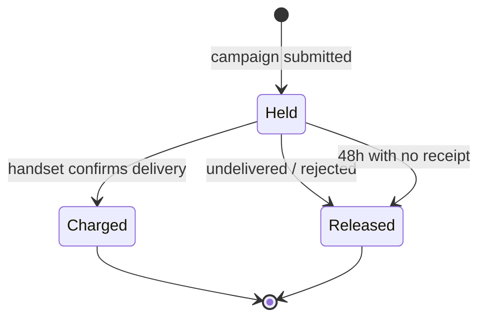

# Money

## The ledger cannot be edited

Every movement is a row in `wallet_ledger`. The balance is **derived** by summing it.
And the table refuses to change:

```sql
CREATE TRIGGER wallet_ledger_append_only
    BEFORE UPDATE OR DELETE ON wallet_ledger
    FOR EACH ROW EXECUTE FUNCTION reject_ledger_mutation();
```

An `UPDATE` — even as the table owner, even from psql — raises
`wallet_ledger is append-only`. This is attacked on **every test run**, because a
guarantee nobody tests is a guarantee nobody has.

!!! failure "Rejected: a mutable balance column"
    Fast, simple, unauditable. Asked "why is my balance ₹42,279.20", a column can only
    answer "because that is what it says". A ledger answers with every movement that
    produced it — and when the two disagree, which eventually happens, the ledger is
    the one you can trust because nothing can rewrite it.

## Amounts are always positive

```sql
amount_minor bigint NOT NULL CHECK (amount_minor > 0)
```

Direction comes from `entry_type` — `topup`, `auto_recharge`, `charge`, `refund`,
`adjustment`. Signing the amount instead would make a charge and a refund
distinguishable only by a minus sign, and would let a negative top-up through as a
charge.

## Hold, then charge



Money leaves the customer's balance **only** on handset confirmation. Everything else
returns it.

## What the adversarial suite proves about money

| Attack | Result |
|---|---|
| Negative top-up | 422 |
| Zero top-up | 422 |
| Top-up with unknown payment method | 422 |
| `UPDATE wallet_ledger` as owner | refused by trigger |
| `DELETE FROM wallet_ledger` as owner | refused by trigger |
