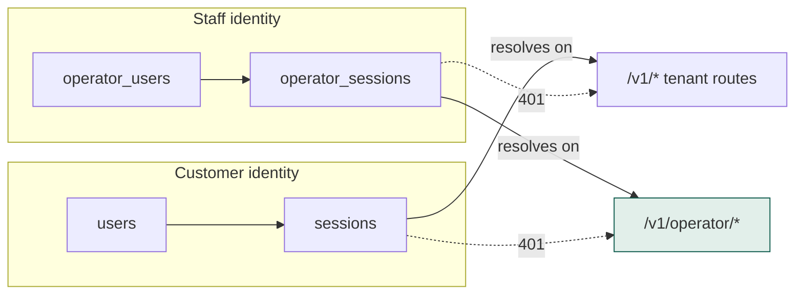

# Operator console

Relay's own staff approve senders, police abuse, set rates and order carrier routes.
That means reading **across** every tenant — the exact thing row-level security exists
to prevent.

## Operators are not privileged customers



A tenant token resolves to **no operator at all**. Operator sessions resolve **only** on
`/v1/operator` paths. Both directions are asserted on every test run.

!!! failure "Rejected: an `is_operator` flag on the user"
    An operator acts across tenants — the one identity that, if compromised, reaches
    every customer at once. Modelling it as a privileged customer means punching a hole
    through the tenant policies for exactly that identity. Keeping the spaces separate
    leaves the tenant policies absolute.

## The visibility escape hatch, made explicit

Operators still need to read across tenants. Three options existed:

| Option | Why not |
|---|---|
| `BYPASSRLS` database role | One leaked connection string voids every policy, everywhere, silently |
| Read through the migration role | Same, plus that role can drop tables |
| **A policy that opens only while a flag is set** | **Chosen** |

```sql
CREATE POLICY tenants_operator_read ON tenants
    FOR ALL USING (acting_as_operator());
    -- acting_as_operator() = current_setting('app.operator', true) = 'on'
```

A dedicated connection pool sets that flag on every connection. Operator handlers use
that pool; tenant handlers never do. If the flag is not set the operator sees **nothing**
— a visible, empty screen, which is a far better failure than an invisible, total one.

## Everything is audited

Every action that changes what a customer experiences writes to `operator_audit_log`,
which carries the same append-only trigger as the wallet ledger.

It stores the tenant **name** as well as the id, because the record outlives the tenant:
"who suspended Acme Retail" must still read as a sentence after the tenant row is gone.

!!! danger "The audit log's filters did nothing at all"
    `GET /v1/operator/audit-log?tenantId=…&action=…` accepted both parameters and
    ignored both, returning the last 100 entries for **every** tenant. The handler
    signature was `func GetAuditLog(ctx, _ gen.GetAuditLogRequestObject)` — the
    underscore discards the request, parameters and all, and Go is perfectly happy
    with that. Nothing warns.

    This is the worst list on the platform to get wrong. The audit log is what
    someone reads during an incident to answer *"who changed this tenant, and
    when"*. A tenant filter that silently widens to everyone has them reading the
    wrong history at the worst possible moment — and it looks right, because rows
    do come back.

## Eight endpoints were ignoring their filters

The audit log was not alone. Grepping for handlers that discard the request object,
then cross-checking each against the contract's parameter types, found **eight**:

| Endpoint | Parameters ignored |
|---|---|
| `GET /v1/developer/api-keys` | `environment` — **required** |
| `GET /v1/developer/webhooks` | `environment` — **required** |
| `GET /v1/developer/ip-allowlist` | `environment` — **required** |
| `GET /v1/conversations` | channel, status, unread |
| `GET /v1/operator/tenants` | status, country |
| `GET /v1/operator/routes` | country, channel |
| `GET /v1/operator/approvals` | type, country, status |
| `GET /v1/operator/audit-log` | tenantId, action |

The three `environment` ones are not a cosmetic bug. That parameter is **required**,
and ignoring it meant the **test**-mode developer page listed **live** API keys and
live webhook URLs. Live and test credentials have very different blast radii, and the
screen exists precisely to keep them apart.

!!! note "Why no test caught this, and what does now"
    A filter that returns *too much* still returns a 200 with plausible rows. Every
    contract test passed; the response validated against the schema, because the
    schema constrains the shape of a tenant, not which tenants belong in the list.

    It was found by reading the generated `*Params` types against the handler
    signatures — mechanically, in one pass:

    ```bash
    grep -rho 'ctx context.Context, _ gen\.[A-Za-z]*RequestObject' internal/api/*.go \
      | sed 's/.*gen\.//;s/RequestObject//' | sort -u \
      | while read op; do
          grep -q "type ${op}Params struct" internal/gen/api/control.gen.go \
            && echo "$op ignores its parameters"
        done
    ```

    A handler that takes no parameters *should* discard the request — `GetMe` and
    `Logout` legitimately do. The bug is only where the contract declares parameters
    and the handler cannot see them.

## Suspend, throttle, flag — three different things

| Action | Effect | Clears |
|---|---|---|
| **Suspend** | Stops sending entirely | the abuse flag — suspension *is* the decision |
| **Throttle** | Still sends, slower | the abuse flag |
| **Flag for abuse** | Adds to the review queue | nothing; flagging twice does not reset the timestamp |
| **Dismiss flag** | Removes from the queue | the flag |

Collapsing throttle into suspend would make "slow them down" indistinguishable from
"cut them off".

## Route ordering

Route priority decides which carrier a customer's traffic actually takes. Reordering
swaps a route with its neighbour inside one transaction, parking one row at a sentinel
priority first — without that, setting A to B's priority collides before B has moved.
