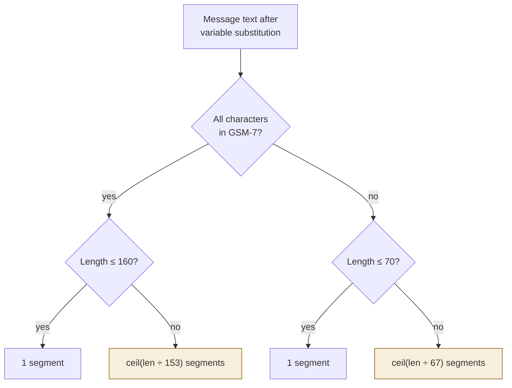

# The send pipeline

Seven steps. Numbered because it genuinely is a sequence — each depends on the one
before.

## The batching loop that mattered

The first working version did **8 Postgres queries and 6 ClickHouse inserts per
message**. It managed **68 messages/second**, against a target needing ~350/second
sustained.

The rewrite batches a whole page: one suppression query, one wallet movement, one
ClickHouse write for all 500 recipients. Same guarantees, same transaction boundaries —
the work per message did not change, the number of round trips did.

| Version | Messages/sec | Round trips |
|---|---:|---|
| Row at a time | 68 | 14 per message |
| Batched, one tenant | 17,921 | 14 per 500 messages |
| Batched, 6 tenants | 38,668 | plus cross-tenant concurrency |

!!! danger "The lesson worth repeating"
    The comment above that function already **claimed** it batched. The code did not.
    Comments describe intent; only a measurement describes behaviour. This was found by
    a load test, not by reading the code.

## Segment arithmetic



The split lengths are smaller than the single-segment lengths because multi-part
messages carry a header describing how to reassemble them. **One emoji in a
160-character message turns 1 segment into 3.**

## Reserving money

```sql
SELECT balance_minor FROM wallet_balances
 WHERE tenant_id = $1 AND currency = $2
   FOR UPDATE;   -- two concurrent campaigns cannot both read
                 -- the same balance and both pass
```

Money is `int64` in minor units — paise, not rupees. No floating point in the money
path, because 0.1 + 0.2 is not 0.3 and a billing system cannot afford that conversation.

## STOP handling

```go
// Whole trimmed body, case-insensitive — NOT "contains". A message that merely
// CONTAINS "stop" ("please don't stop the offers") is not an opt-out, and
// treating it as one silently suppresses a customer who asked for the opposite.
var stopKeywords = map[string]bool{
    "STOP": true, "UNSUBSCRIBE": true, "CANCEL": true,
    "END": true, "QUIT": true, "OPTOUT": true,
}
```

The suppression is the point. An inbound STOP that only appended a message would leave
the person opted out in the transcript but still reachable by the next campaign — the
compliance failure regulators fine for.

## Giving up honestly

```go
const DefaultValidityWindow = 48 * time.Hour

// One tenant must never stall the sweep for everybody else.
failures = append(failures, fmt.Errorf("message %s (tenant %s): %w", ...))
continue
```

The loop collects failures and keeps going rather than returning on the first one. A
single tenant with corrupt data must not stop every other tenant's money being released.
