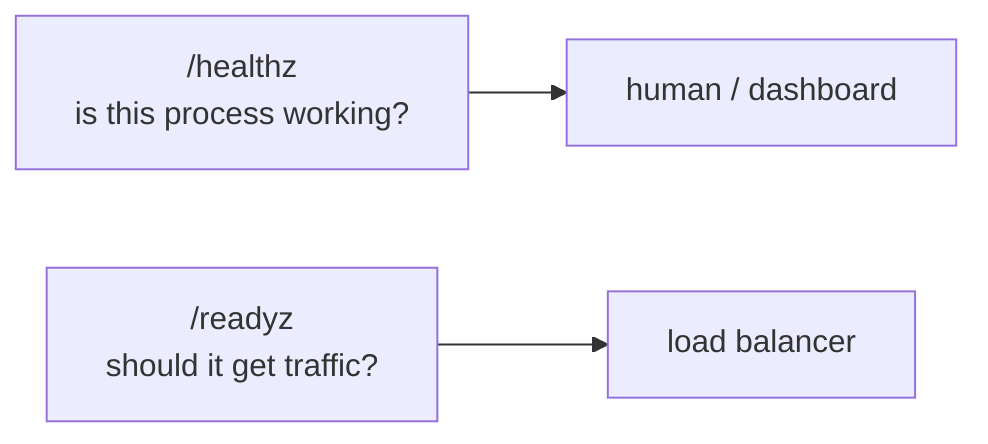

# Reliability

Three failures used to need a human. None of them do now, and each was verified by
causing it.

## A dependency that is down at boot

Binding ClickHouse once at startup meant that if it was slow to become ready on a server
reboot — where every service starts at once — the API came up **permanently** without
message logs.

The handle now connects on demand and keeps trying, with a rate limit so one outage does
not become a connection storm against a server already struggling.

## A dependency that restarts later

The driver pools connections, so a handle that already believes it is connected keeps
handing out dead ones. A failed query now drops the handle and the next request redials.

The health endpoint repairs it as a side effect — so the thing that **notices** recovery
is the same thing that reports it, with no operator action.

## A worker that panics

A panic inside a goroutine takes down the **entire process**, not just that goroutine. A
nil map access in the reconciler would kill the API for every tenant.

```go
defer func() {
    if recovered := recover(); recovered != nil {
        stack := string(debug.Stack())
        logger.Error("worker panicked — recovered, will retry next tick", ...)
    }
}()
```

The worker is restarted on the next tick. The panic is recorded as an incident visible
on `/metrics`.

## Health versus readiness



ClickHouse being down is **reported but does not fail the check**. It holds message logs
and analytics; every other domain works without it. Failing the check would make a load
balancer pull a node that can still serve authentication, campaigns, billing and
compliance — a worse outage than the one being reported.

## What the adversarial suite covers

35 checks, and a pass means the attack was **refused**:

- Reading another tenant's sender by id → **404** (deliberately not 403, which would confirm the id exists)
- Deleting or renaming another tenant's list → **404**, victim data intact
- SQL injection in body and query → stored as literal text, tables survive
- Broken JSON, wrong field types, 400-deep nesting → **422**, no crash
- Ledger and audit-log mutation → refused by trigger
- Tenant token on operator routes, operator token on tenant routes → **401**
- After all of it: healthz ok, readyz ready, **zero new 5xx**
