# Every screen, every button

**This page exists so that a junior can point at any button and know exactly what
happens in the backend when it is clicked.**

Every screenshot is real, taken from the running product signed in as
`founder@acme.test` with the seeded Acme Retail data. Every endpoint named is the one
actually called.

---

## Overview

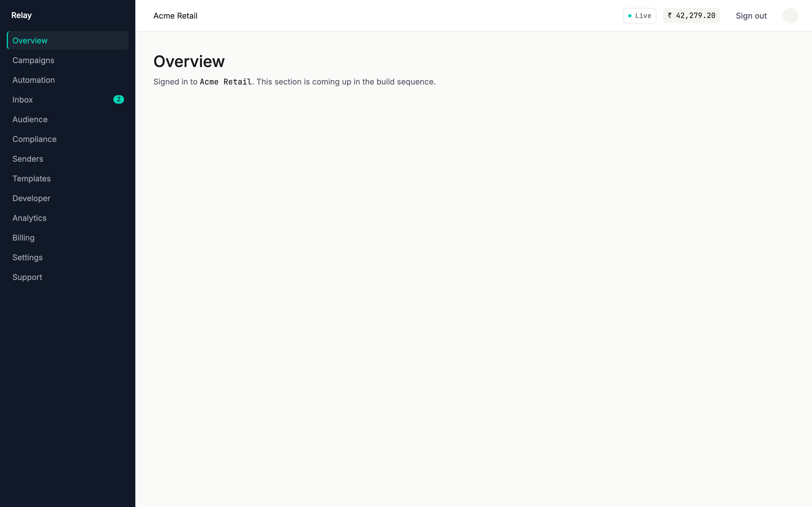

The landing screen after sign-in. It is a read-only summary — nothing here changes
state.

| What you see | Where it comes from |
|---|---|
| Wallet balance in the header | `GET /v1/wallet` — derived by summing the ledger, never a stored figure |
| Recent campaigns | `GET /v1/campaigns` |
| Delivery numbers | `GET /v1/analytics?range=30d` → ClickHouse rollup |

**The environment switch (Live / Test)** in the header sets a cookie the UI sends on
later requests. Test and Live have separate API keys — the same screen, different data.

---

## Campaigns

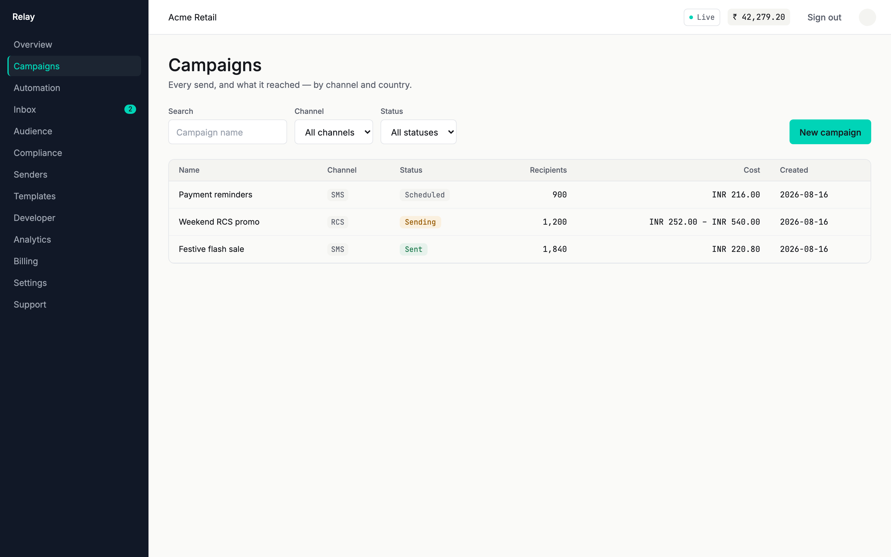

| Button | Backend | What actually happens |
|---|---|---|
| **New campaign** | — | Navigates to the six-step wizard |
| A campaign row | `GET /v1/campaigns/{id}` | Opens detail with per-message outcomes |
| **Retry failed** (on detail) | `POST /v1/campaigns/{id}/retry` | Creates a **new** campaign containing only the failed recipients, linked back by `retry_of`. It does not re-send the original — resending a campaign that already charged for delivered messages would double-bill them. |

### The campaign wizard

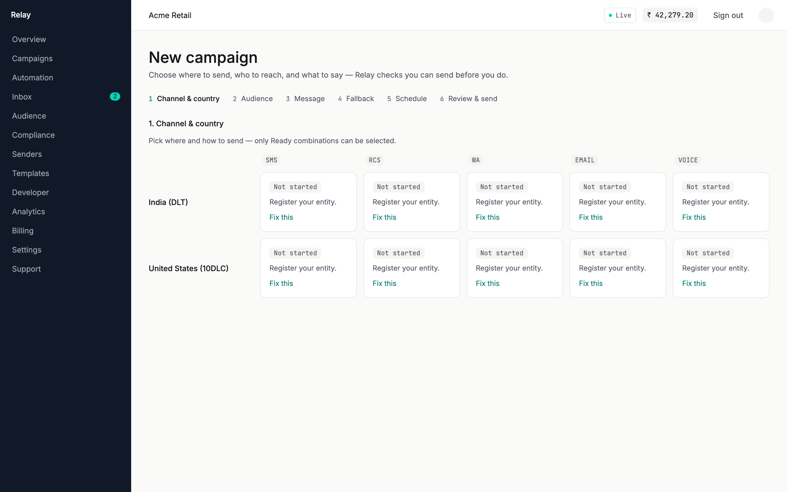

Six steps, and each one is a guard rather than a form field:

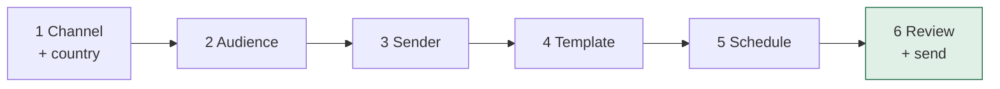
```mermaid
flowchart LR
    A[1 Channel<br/>+ country] --> B[2 Audience]
    B --> C[3 Sender]
    C --> D[4 Template]
    D --> E[5 Schedule]
    E --> F[6 Review<br/>+ send]
    style F fill:#E1F0E7,stroke:#1D6B45
```

| Step | Guard enforced |
|---|---|
| 1 · Channel + country | Only combinations you are compliant for are selectable |
| 2 · Audience | Shows **reachable** count, not list size — opted-out and suppressed contacts are already excluded |
| 3 · Sender | Only `approved` senders for that country and channel appear |
| 4 · Template | Only `approved` templates bound to that sender |
| 5 · Schedule | Now, or a future time |
| 6 · Review | Shows a cost **range**, then **Send campaign** |

**Send campaign** calls `POST /v1/campaigns`. Before a single message goes out the
backend re-checks consent, re-prices, and reserves the money. The wizard's guards are
convenience; these checks are the real enforcement, because an API caller never saw
the wizard.

!!! note "Why a cost range and not one number"
    A message's cost depends on how many segments it becomes, and that depends on the
    characters in it after variables are substituted. `{{first_name}}` might be "Jo"
    or "Priyadarshini". The range is honest; a single number would be a guess.

---

## Audience

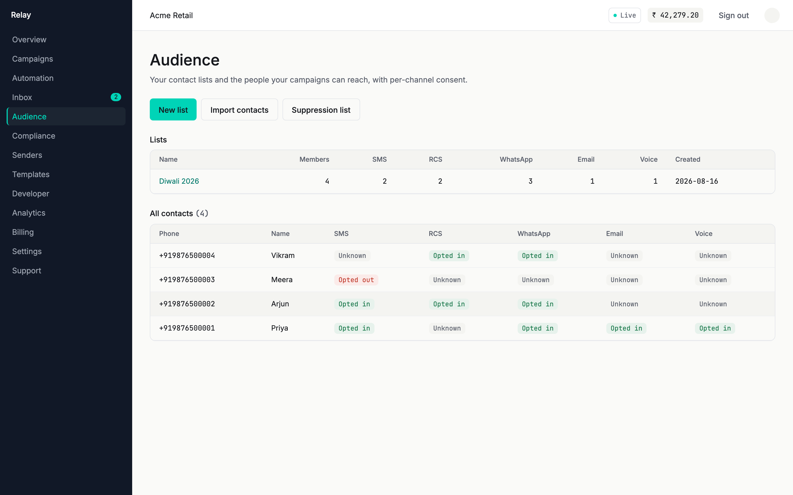

| Button | Backend | Notes |
|---|---|---|
| **Import** | `POST /v1/contacts/import` | CSV upload, previewed before commit |
| **New list** | `POST /v1/contact-lists` | |
| A list row | `GET /v1/contact-lists/{id}` | Members and per-channel consent |
| **Suppressions** | `GET /v1/suppressions` | The do-not-contact register |

Seeded list **"Diwali 2026"** holds four contacts. Consent is **per channel** — Priya
is opted in for SMS but unknown for RCS. A campaign only counts contacts opted in for
*its* channel, which is why 4 members can mean 2 recipients.

!!! warning "A bug this caused, worth knowing"
    The member count once read 8 for a 4-person list. The query joined a lateral
    expansion of the consent map, producing one row per opted-in channel per contact.
    The fix is `count(DISTINCT c.id)`. A count that is silently double is worse than
    one that is obviously missing.

### The WhatsApp 24-hour window

WhatsApp has a rule no other channel has. For **24 hours** after a customer last
interacts with you, you may send them anything. After that, only a **pre-approved
template**. So "may we message this person on WhatsApp?" and "may we message them
**freely, right now**?" are two different questions, and the list screen answers
both:

| Number | Question it answers | On "Diwali 2026" |
|---|---|---|
| `consentedCounts.WHATSAPP` | Have they ever opted in? | **3** |
| `waSessionActive` | Are they still inside the 24h window? | **2** |

The two differ because **Arjun** last interacted 30 hours ago. He is fully opted
in — but reaching him now needs an approved template, not free text.

!!! note "Why this is counted per request, not stored"
    The window is measured from the customer's last interaction, so people drift
    out of it as time passes with nothing happening. A stored count would be wrong
    within the hour and wrong in the dangerous direction — reporting that someone
    is reachable when they are not.

### Suppressions

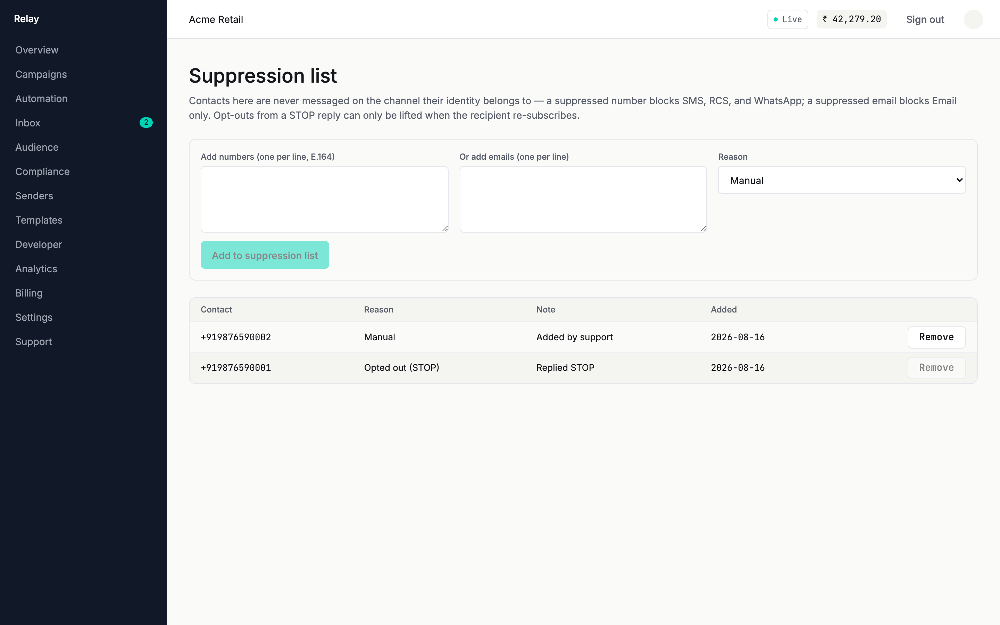

Two rows are seeded, deliberately with **different reasons** — one
`opted_out_keyword`, one `manual` — because the screen groups by reason and a list
where every row says the same thing cannot show that grouping works.

When a customer texts **STOP**, the backend writes a suppression with the note
"Replied STOP". The keyword match is on the **whole trimmed message**, not a
substring: "please don't stop the offers" is not an opt-out.

---

## Compliance

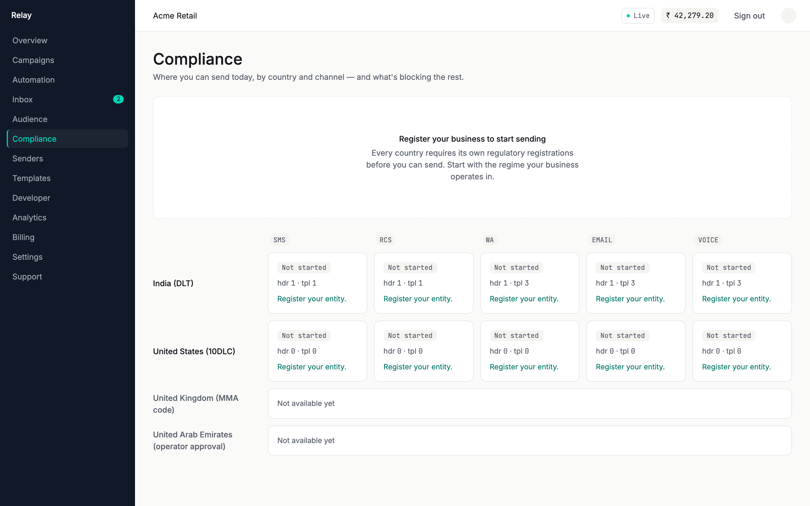

The readiness board. Each cell is one country × channel, and each says whether you can
actually send.

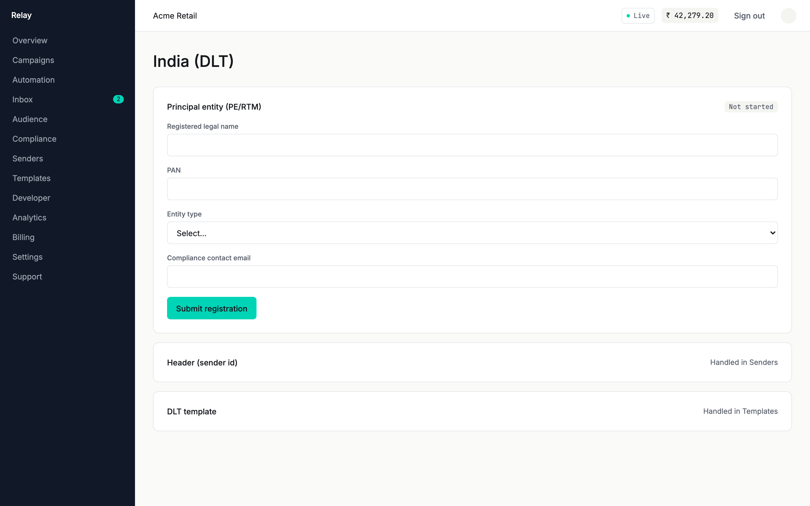

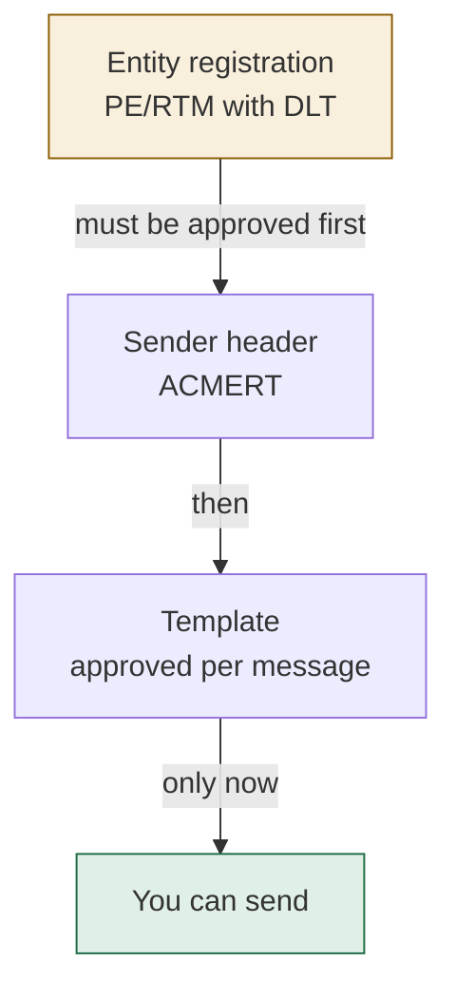
```mermaid
flowchart TB
    E[Entity registration<br/>PE/RTM with DLT] -->|must be approved first| H[Sender header<br/>ACMERT]
    H -->|then| T[Template<br/>approved per message]
    T -->|only now| S[You can send]
    style E fill:#F8EFDC,stroke:#8A5B00
    style S fill:#E1F0E7,stroke:#1D6B45
```

| Button | Backend |
|---|---|
| **Submit registration** | `POST /v1/registrations` — status becomes `pending_review` |
| **Go to compliance** (from Senders) | Navigation only — appears when the entity is not yet approved |

A rejection shows the **registry's own words** — "Submitted details did not match the
registry." — not ours, because those words tell the customer what to fix.

---

## Senders

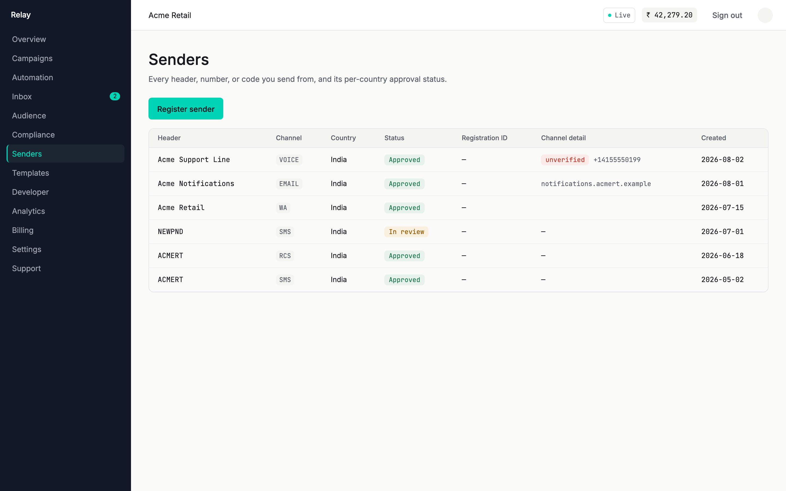

| Button | Backend | Guard |
|---|---|---|
| **Register sender** | `POST /v1/sender-ids` | The form does not appear until the country's entity is approved; instead you see "Your India entity must be approved before you can register a sender" |

For an **email** sender the backend also creates three DNS records in the same
transaction — SPF, DKIM, DMARC — each verifying independently, because "DKIM verified,
DMARC pending" is the normal middle state of onboarding.

---

## Templates

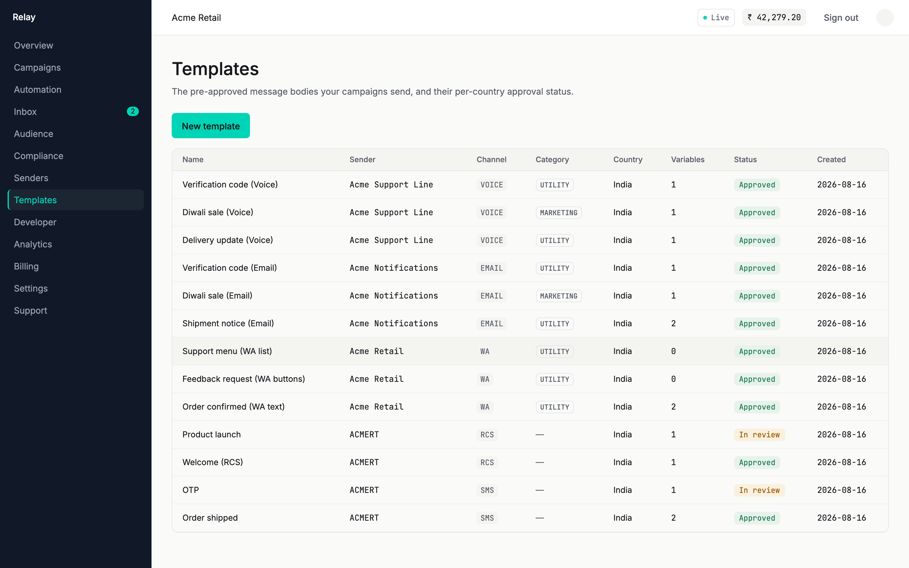

| Button | Backend |
|---|---|
| **New template** | Navigates to the editor |
| **Create template** | `POST /v1/templates` — starts `pending_review` |

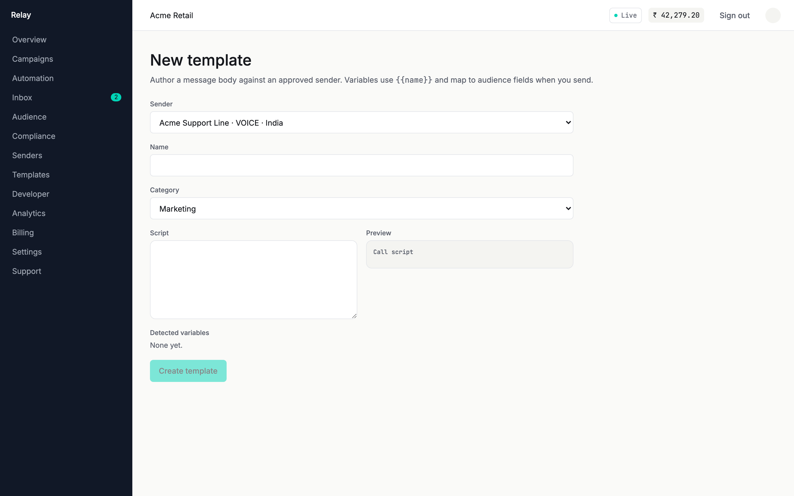

Typing `{{first_name}}` makes a variable chip appear immediately — that is client-side
detection, so you see what the message will need before saving. A CTA URL using a
**link shortener is blocked inline** for India: shorteners are not permitted under DLT
rules, and catching it here saves a rejection cycle that takes days.

### Only SMS is just a string

The editor changes shape per channel, because the message itself has a different
form on each one:

| Channel | What a template holds | Stored as |
|---|---|---|
| **SMS** | One body, `{{variables}}` inline | `body` |
| **Voice** | One body, read aloud by the call | `body` |
| **RCS** | Either a text with tappable **suggestion chips**, or a **card** with an image, title and description | `rcs_content` |
| **WhatsApp** | Text, **reply buttons**, or a **list menu** with titled sections | `wa_content` |
| **Email** | **Subject**, HTML body, and an optional preheader | `email_content` |

Real examples from the demo tenant:

- *Feedback request (WA buttons)* — "Hi {{first_name}}, how was your order?" with
  `Great`, `Not great`, and a `Leave a review` link button.
- *Support menu (WA list)* — "How can we help today?" opening a `View options`
  menu of `Track my order` / `Start a return` / `Talk to a person`.
- *Product launch (RCS card)* — an image, "Meet {{product}}", and a `Shop now`
  chip.
- *Diwali sale (Email)* — subject "{{first_name}}, our Diwali sale starts now",
  preheader "20% off everything".

!!! note "Why these are one JSON column each, not columns per field"
    Each of these is a *discriminated union* — WhatsApp content is text **or**
    buttons **or** a list — and the set of variants belongs to WhatsApp, not to us.
    A column per variant would mean a schema migration every time Meta ships a new
    message type, and twenty mostly-null columns after a few of those.

    The trade is that the database cannot check the shape, so the API validates it
    against the contract on write. What the database *does* enforce is that content
    matches its channel: an SMS template physically cannot hold WhatsApp buttons.
    Without that, a template could carry two conflicting bodies and whichever
    renderer looked first would win — which surfaces as the wrong message arriving
    at a customer, not as an error anyone sees.

---

## Developer

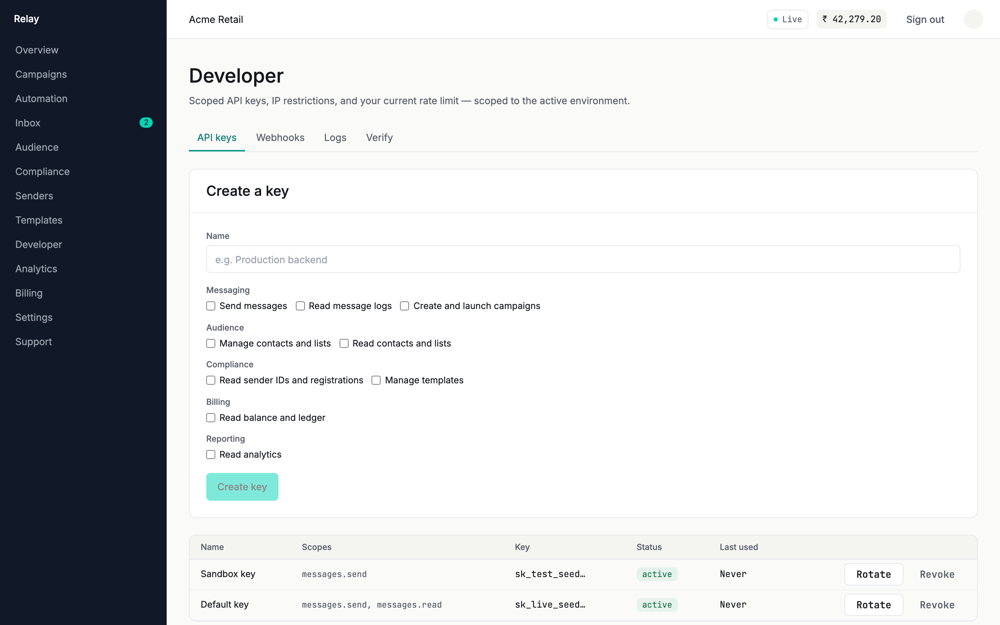

| Button | Backend | Important behaviour |
|---|---|---|
| **Create key** | `POST /v1/developer/api-keys` | The secret is shown **once**. Only a hash is stored, so we genuinely cannot show it again. |
| **Rotate** | `POST /v1/developer/api-keys/{id}/rotate` | Issues a new secret, revealed once |
| **Revoke** | `DELETE /v1/developer/api-keys/{id}` | Requires a confirm click |
| **Add** (IP allowlist) | `POST /v1/developer/ip-allowlist` | Empty by default — no restriction |

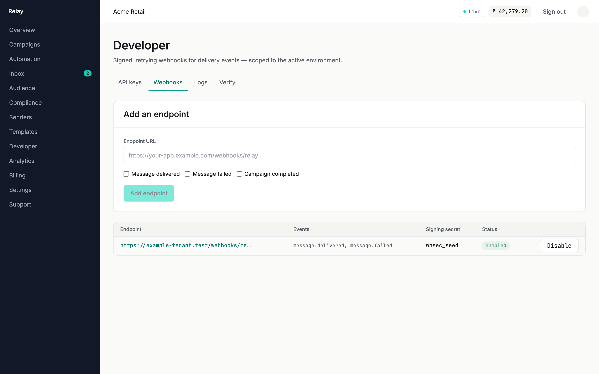

| Button | Backend |
|---|---|
| **Add endpoint** | `POST /v1/developer/webhooks` |
| **Send test event** | `POST /v1/developer/webhooks/{id}/test` |
| **Resend** | `POST /v1/developer/webhooks/events/{id}/resend` |

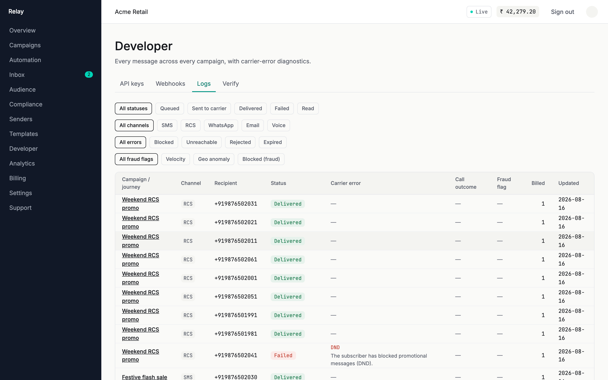

The message explorer, reading ClickHouse. Filters by status, channel, country and
fraud flag. This is the screen that answers "what happened to this one message".

---

## Analytics

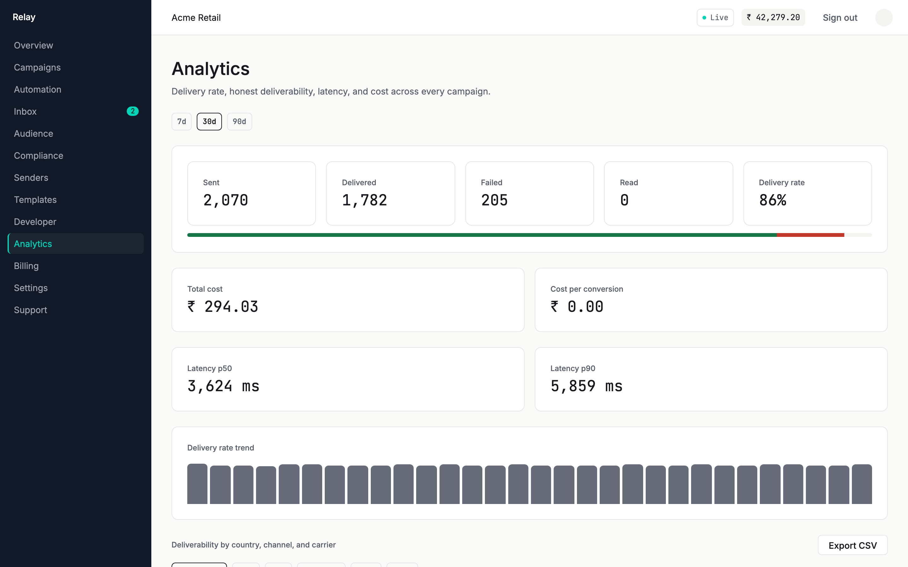

Everything here is measured, not estimated:

| Tile | Source |
|---|---|
| Sent / Delivered / Failed | ClickHouse rollup, counting attempts once |
| Delivery rate | `delivered ÷ attempted` |
| Latency p50 / p90 | `created_at → delivered_at`, handset-confirmed |
| Cost | Sum of delivered message cost |
| Fraud counts | `fraud_flag` on message rows |
| Deliverability by carrier | Message rows grouped by carrier |

The range chips (7d / 30d / 90d) and the channel and country filters are **links**,
not form controls — each carries a query string, so any filtered view is a URL you can
share or bookmark.

!!! danger "Known issue, frontend-side"
    Clicking a filter chip currently does not change the URL. Navigating directly to
    the same URL works, and the server renders every filter combination correctly.
    Reproduction: `SMS-UI/e2e-probe-chip.mjs`.

---

## Billing

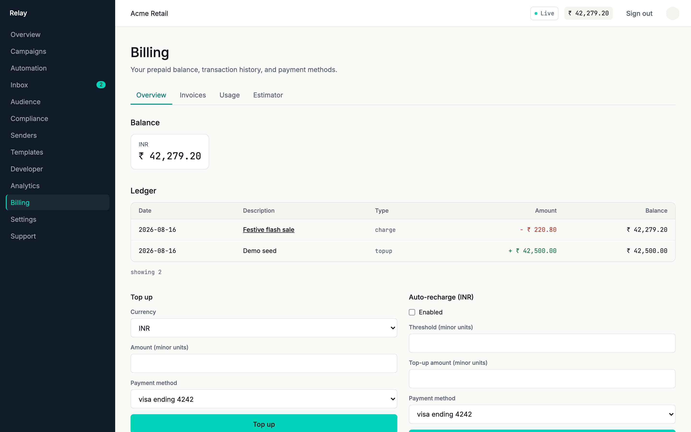

| Button | Backend | What happens |
|---|---|---|
| **Top up** | `POST /v1/wallet/topup` | Charges the saved card, appends a `topup` row, balance moves |
| **Auto-recharge** | `PUT /v1/wallet/auto-recharge` | When the balance crosses a threshold, top up automatically |

The ledger below the balance is **append-only at the database level**. A trigger
refuses `UPDATE` and `DELETE` — even from psql, even as the table owner. The balance
shown is derived by summing it, so the two cannot disagree.

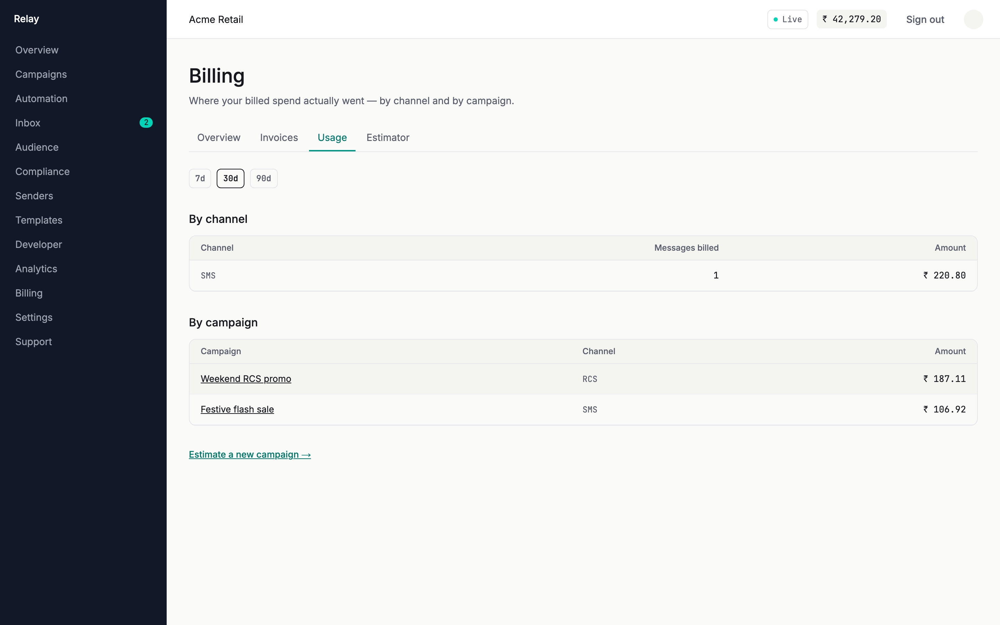

Spend by channel, by campaign, and by journey. Channel totals come from the wallet;
campaign and journey attribution comes from the message rows, because only a message
knows what caused it.

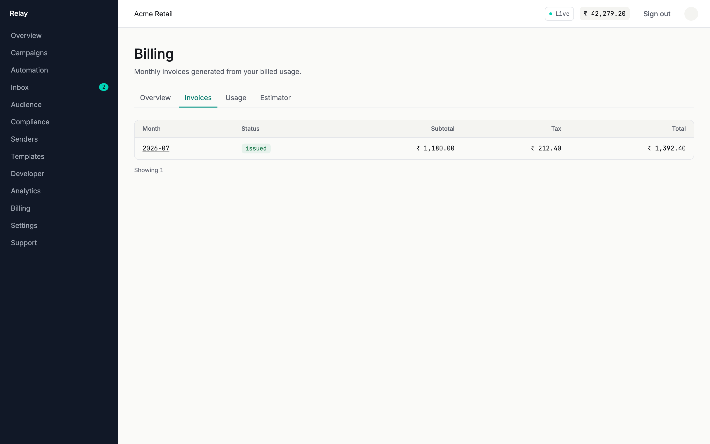

Clicking an invoice calls `GET /v1/billing/invoices/{id}` and shows line items with a
computed total — subtotal, 18% tax, total.

---

## Settings

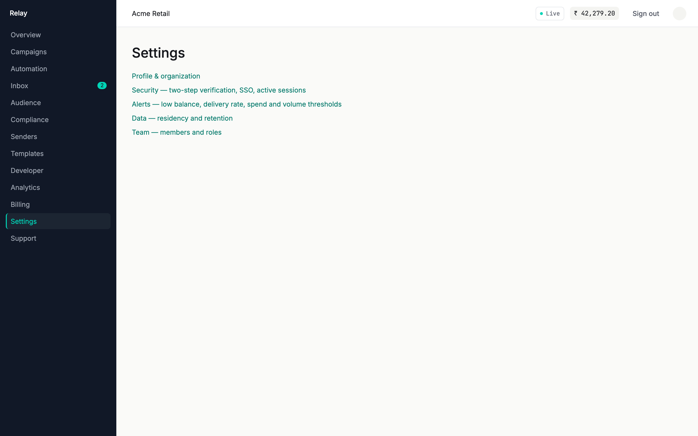

| Button | Backend |
|---|---|
| **Save** (profile) | `PATCH /v1/me` |
| **Update password** | `POST /v1/auth/change-password` — requires the current password |
| **Enable MFA** | `POST /v1/auth/mfa/enroll` then `/verify` — TOTP, with recovery codes shown once |
| **Invite** (team) | `POST /v1/team/invite` |
| **Save** (alerts) | `PUT /v1/alerts` |
| **Save** (data retention) | `PUT /v1/data-retention` — 30, 90, 180 or 365 days |

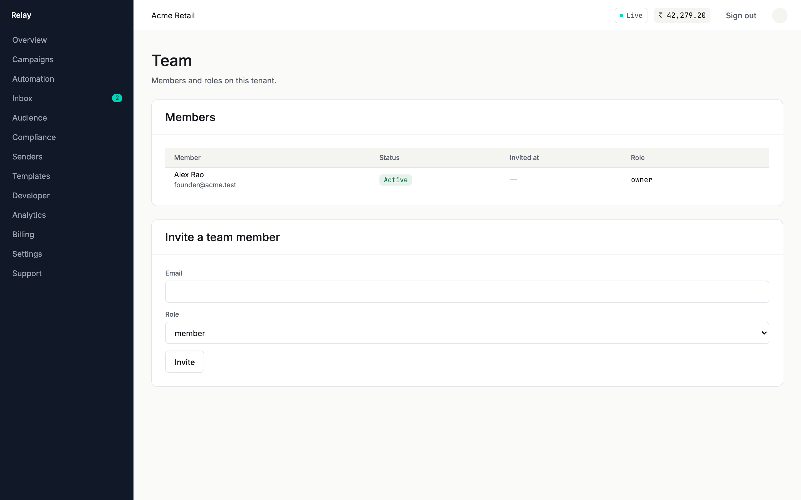

Roles are **owner**, **admin**, **member**. A member sees a restricted view; navigating
to a page their role cannot access shows a "Restricted" screen rather than a 403 —
the middleware rewrites the response rather than redirecting, so the URL stays put.

---

## Support and Inbox

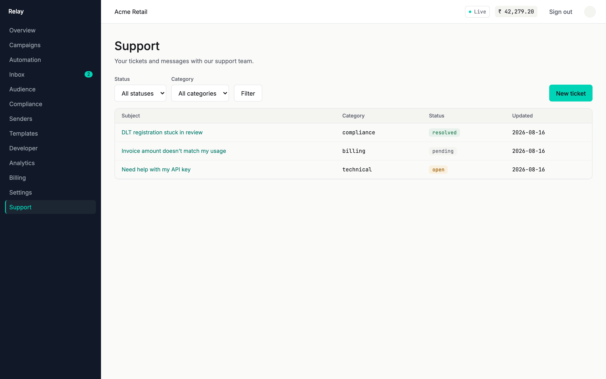

| Button | Backend |
|---|---|
| **Start a ticket** | `POST /v1/support/tickets` |
| **Reply** | `POST /v1/support/tickets/{id}/messages` — a customer reply reopens a resolved ticket |

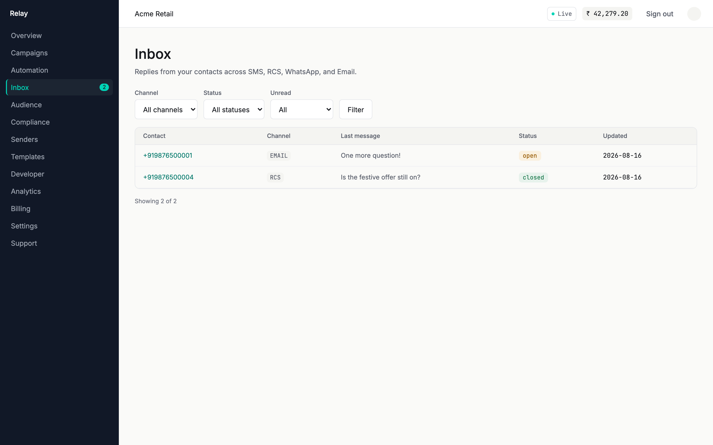

Two-way conversations with contacts. An inbound message marks the thread unread; an
outbound reply clears it, because sending a reply means you read what came before.

---

## Operator console

Separate identity, separate login, separate session table. A customer token cannot
reach any of these screens — it returns **401**, verified on every test run.

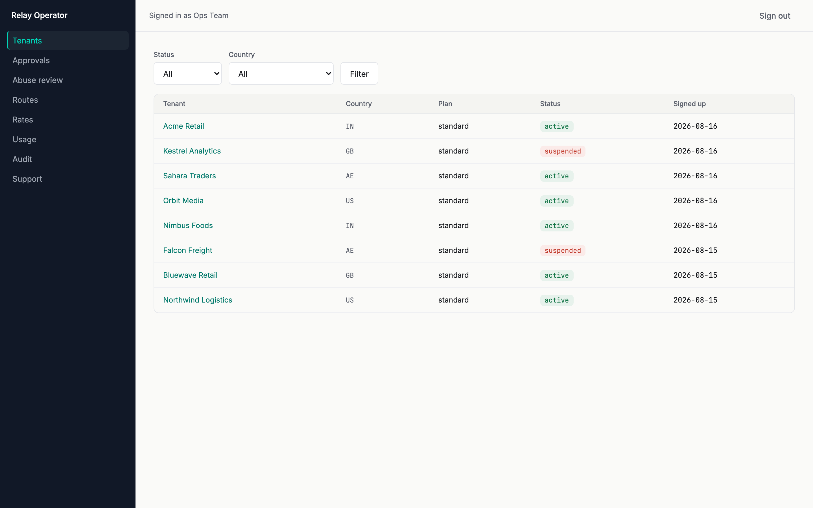

| Button | Backend | Effect |
|---|---|---|
| **Suspend** | `POST /v1/operator/tenants/{id}/suspend` | Tenant stops sending; clears any abuse flag, because suspension *is* the decision |
| **Reinstate** | `.../reinstate` | Clears suspension and throttle |
| **Throttle** | `.../throttle` | Still sends, just slower — deliberately distinct from suspend |
| **Flag for abuse** | `.../flag-abuse` | Adds to the abuse queue; flagging twice does not reset the timestamp |
| **Dismiss flag** | `.../dismiss-flag` | Removes from the queue |

Every one of these writes an audit entry naming the operator. That table is
append-only too.

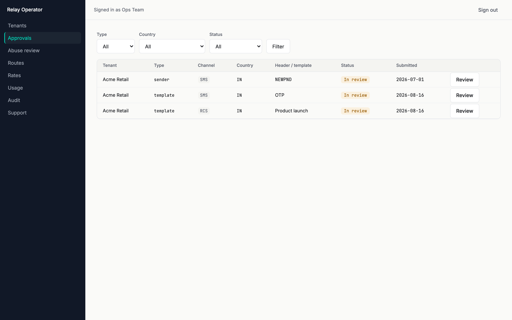

Senders and templates awaiting a decision, in one queue — an operator works through
"what needs a decision", not "what kind of thing needs a decision".

**Reject** requires a reason. A rejection with no reason is useless to the customer
receiving it: they cannot fix what they are not told about.

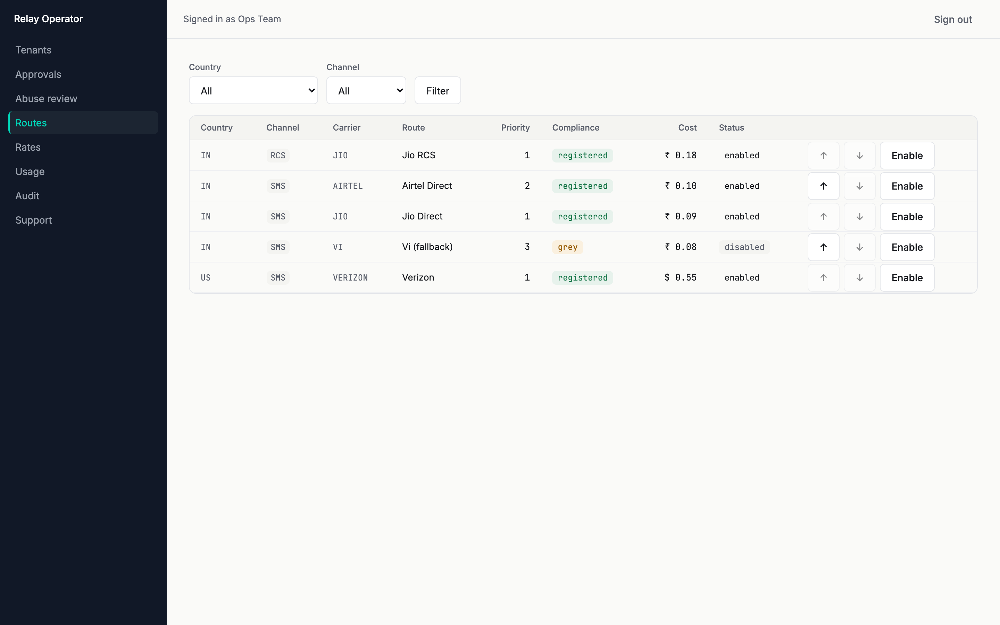

| Button | Backend | Effect |
|---|---|---|
| **Move up / Move down** | `POST /v1/operator/routes/{id}/move-up` | Swaps priority with its neighbour, in one transaction |
| **Disable / Enable** | `.../disable` | A disabled route is skipped and excluded from cost comparisons |

Route order decides which carrier a customer's traffic actually takes, so every change
is audited exactly like a suspension.

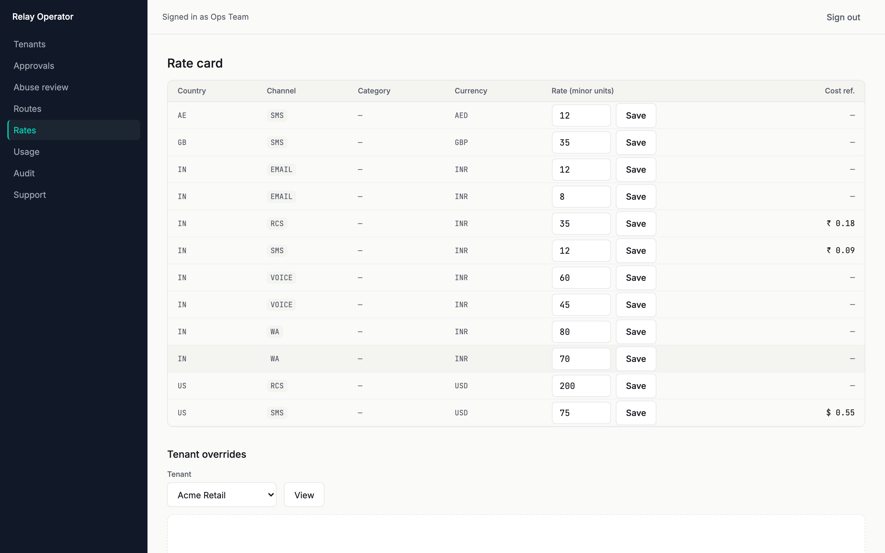

Default rates plus per-tenant overrides. Each row shows a **cost reference** — the
cheapest *enabled* route for that corridor — so an operator setting a price can see
the floor. Disabled routes are excluded: a cheap route nobody may use is not a cost
floor.

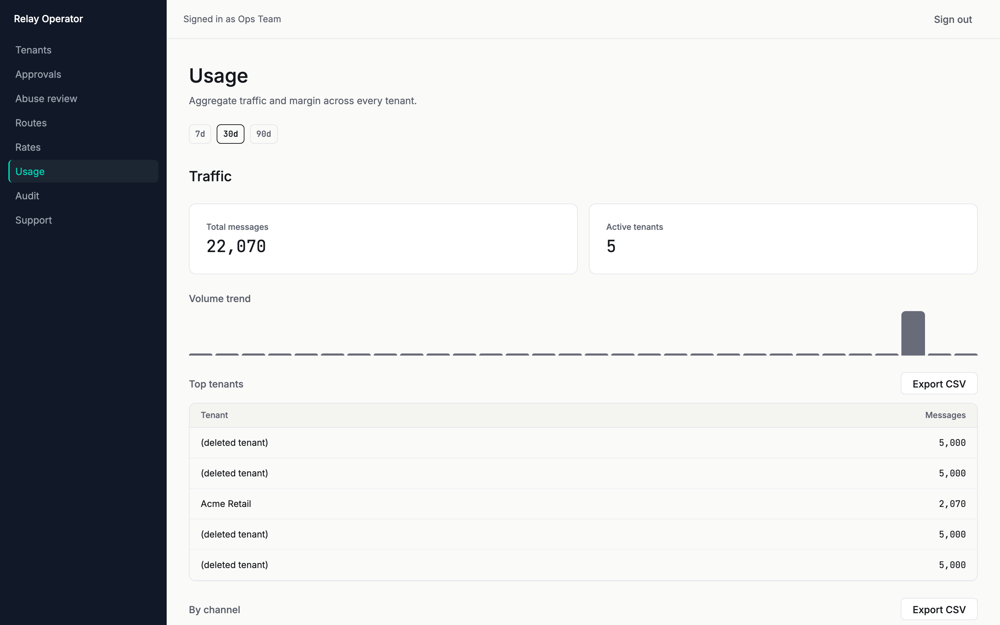
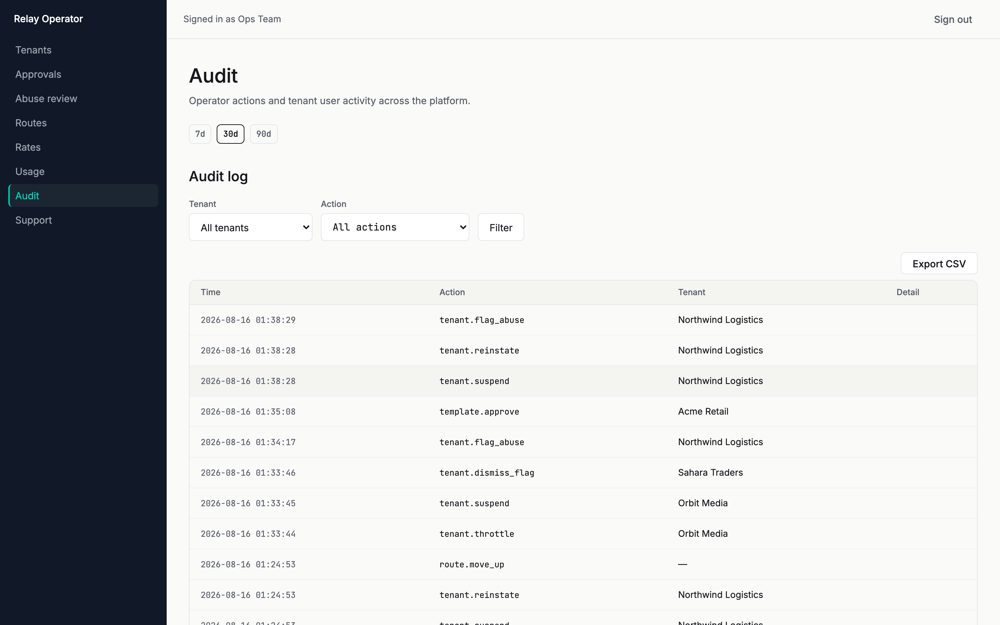

The audit log answers "who did this, to whom, and when" months later. It stores the
tenant **name** as well as the id, so the entry still reads as a sentence after the
tenant row is gone.

---

## What happens on every single request

Before any handler runs:

```mermaid
sequenceDiagram
    participant B as Browser
    participant M as Auth middleware
    participant D as Postgres
    participant H as Handler
    B->>M: Bearer token
    M->>M: SHA-256 the token
    alt path starts /v1/operator
        M->>D: look up operator_sessions
    else everything else
        M->>D: look up sessions
    end
    D-->>M: identity (tenant id)
    M->>H: request + identity in context
    H->>D: BEGIN; set_config('app.tenant_id', …, true)
    Note over D: row-level security now filters<br/>every query to this tenant
    H->>D: the actual query
    D-->>H: only this tenant's rows
```

The two lookups are deliberately separate. A tenant token must never satisfy an
operator route, and an operator token must never scope a tenant query. The moment
those share a code path, one missing branch becomes a cross-tenant leak.
