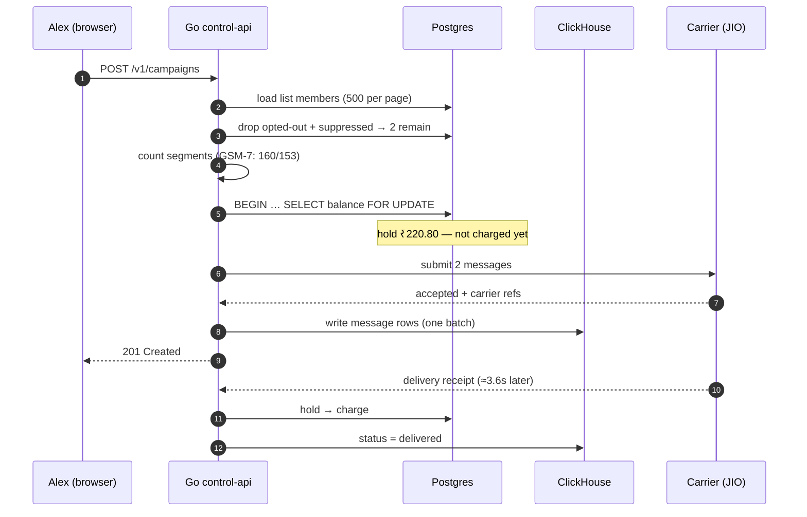

# The product in one message

One real message, from a form to a handset. Every name and number here comes from the
running system.

## The cast

| | |
|---|---|
| Tenant | **Acme Retail**, an Indian retailer |
| Owner | **Alex Rao** — `founder@acme.test` |
| Wallet | **₹42,279.20** |
| Sender | **ACMERT** (SMS, India, approved) |
| List | **Diwali 2026** — 4 contacts |
| Campaign | **Festive flash sale** |

The list:

| Contact | Number | SMS consent | Will receive? |
|---|---|---|---|
| Priya | +919876500001 | opted in | ✅ |
| Arjun | +919876500002 | opted in | ✅ |
| Meera | +919876500003 | opted out | ❌ |
| Vikram | +919876500004 | unknown | ❌ |

**Four members, two recipients.** Consent is per channel, and "unknown" is not consent.

## What happens when Alex presses Send



## Step by step, with the reason

**1 · Load the audience in pages of 500.** A list of two million contacts must not
become a two-million-row result set in memory.

**2 · Drop who cannot be messaged.** Meera opted out; Vikram never opted in.
Suppression is checked in *one* query for the whole page, not once per contact.

**3 · Count segments.** SMS bills per segment. Latin text is GSM-7: 160 characters in
one segment, 153 each once it splits (the segments carry reassembly headers). One emoji
forces UCS-2: 70, or 67 split. **A single emoji can turn one segment into three** — a
threefold billing error if you get it wrong.

**4 · Reserve the money.** `SELECT … FOR UPDATE` locks the balance row so two campaigns
cannot both read the same balance and both pass. Money is `int64` paise — no floating
point anywhere in the money path.

**5 · Submit to the carrier.** India SMS routes to **JIO** first, **AIRTEL** second.
The message becomes `accepted`. **Not charged.**

**6 · Wait for the handset.** A worker drains receipts every 2 seconds. On arrival the
message becomes `delivered` and the hold becomes a charge. Measured: **p50 3,624 ms,
p90 5,859 ms**.

**7 · Give up honestly.** A reconciler sweeps every 15 minutes and expires anything
older than **48 hours**, releasing the hold. Without it, one lost receipt means a
customer is charged forever for a message nobody can prove arrived.

## The result in the ledger

```
topup    +₹42,500.00   balance ₹42,500.00
charge     −₹220.80    balance ₹42,279.20   "Festive flash sale"
```

That is the same ₹42,279.20 shown in the dashboard header — because the header derives
it by summing this ledger, not by reading a separate column that could drift.
